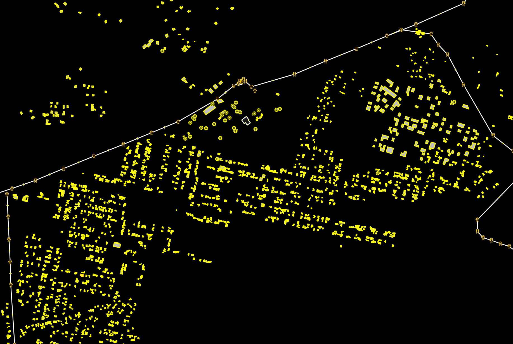

# earthpv - rooftop solar detection from Sentinel-2

Detects rooftop solar PV arrays (target ≥ ~500 m², smaller where possible) from
Sentinel-2 L2A imagery by fine-tuning the open-source **TerraMind** geospatial
foundation model (IBM/ESA, 2025) with **TerraTorch**. Labels come from
OpenStreetMap solar mapping via **Overture Maps** (`source_tags` on the
base/infrastructure layer); building footprints and admin boundaries also come
from Overture. Designed to be recall-oriented: candidates are meant to be
human-validated against imagery in OSM workflows (MapRoulette export included).

- **Training region:** Germany (dense OSM solar labels, geographic train/val split by state)
- **Inference target:** Punjab, Pakistan (building-screened chip grid)
- **Imagery:** multi-temporal cloud-free composites (2025-03 → 2026-02), 12 S2L2A bands, 10 m,
  from Microsoft Planetary Computer

## Setup

Prerequisites: an NVIDIA GPU for training/inference (this project targets a **GTX
1060, Pascal sm_61** — see the cu126 note in Operational notes below; anything
newer works too), and — for the AOIs already configured (`germany`, `punjab`,
`pakistan`) — the sibling `rooftopsenti` project's Sentinel-2 composites/labels on
the same machine (`local_root` in `configs/aoi.yaml`). **You don't need that sibling
project to run this on a new region** — see "Running on a new region" below for the
fully-standalone path (Overpass labels + `compose` + VIDA buildings), which is what
`gujarat` (already in `configs/aoi.yaml`) uses.

```bash
pixi install          # data pipeline env (DuckDB, geopandas, rasterio, odc-stac)
pixi install -e ml    # + PyTorch cu126 (Pascal-safe) + TerraTorch, multi-GB solve
pixi run -e ml gpu-check   # confirms torch.cuda.is_available() and the device name
```

Two environments share one pixi solve-group: `default` (no PyTorch, used for every
data/network stage) and `ml` (adds `torch`/`terratorch`, only needed for
`train`/`infer`/`evaluate`/`hard-negatives`). Calling `.pixi/envs/ml/bin/python -m
earthpv.cli ...` directly skips pixi's per-invocation overhead on long runs.

## Quickstart (smoke test)

A complete, minutes-long, low-cost run through every stage that touches the GPU —
do this first on a fresh checkout to confirm the environment actually works before
committing to a multi-hour real run:

```bash
pixi run earthpv labels --aoi freiburg                      # tiny bbox, seconds
pixi run earthpv chips --aoi freiburg --limit 50             # 50 chips, ~1 min
pixi run -e ml earthpv train --config configs/terramind_pv.yaml --smoke   # 50 steps
pixi run -e ml earthpv evaluate --aoi freiburg --checkpoint data/models/last.ckpt
```

`--smoke` on `train` runs 50 optimizer steps — enough to confirm the model loads,
the GPU is used, and a checkpoint is written, not enough to detect anything (loss
will not have converged; don't read anything into `evaluate`'s numbers here). If
this all runs without error, move on to a real chip/train run below.

## Full pipeline

Ordered by dependency; every stage after `train` needs a checkpoint path
(`data/models/<run>/<epoch>.ckpt`), and every stage is resumable / safe to re-run
(existing chips/composites/predictions are skipped, not rebuilt) — this matters
because most real runs here are network- or GPU-bound for hours, see Operational
notes for how to run them detached and recover from interruption.

**1. Labels** — building footprints + OSM solar polygons for an AOI.

```bash
pixi run earthpv labels --aoi germany
# Freshly-mapped region, bypassing Overture's snapshot lag (e.g. right after hand-mapping):
pixi run earthpv overpass-labels --place "Lahore" --iso3 PAK
```

**2. Chips** — Sentinel-2 composite windows + burned PV masks, the training set.

```bash
pixi run earthpv chips --aoi germany                         # full run, ~3-4k chips
pixi run earthpv chips --aoi germany --limit 500              # capped, for iteration
# Regression target (continuous per-pixel PV coverage fraction) instead of binary mask:
pixi run earthpv chips --aoi germany --fraction
```

**3. Train** — fine-tune TerraMind via TerraTorch (needs the `ml` env / GPU).

```bash
pixi run -e ml earthpv train --config configs/terramind_pv.yaml
# Merge multiple AOIs' chips into one training set first (2x oversamples pakistan's
# train rows so Germany's larger chip count doesn't swamp the in-domain signal):
.pixi/envs/default/bin/python scripts/merge_chip_index.py germany pakistan:2
```

**4. Evaluate** — pixel IoU/F1 + per-installation recall bucketed by array size.

```bash
pixi run -e ml earthpv evaluate --aoi germany --checkpoint data/models/<run>/<epoch>.ckpt
```

**5. Compose** — build Sentinel-2 composites for AOIs with no local imagery
(building-populated cells only, via Planetary Computer STAC; skip this for AOIs that
already have `source_region` composites, e.g. `germany`).

```bash
pixi run -e ml earthpv compose --aoi punjab --min-buildings 1000 --workers 6
# A second epoch on the same grid (e.g. the pre-2022-boom baseline for Pakistan's
# change-detection track — see "Planned: two-epoch change detection" below):
pixi run -e ml earthpv compose --aoi pakistan --index 1 \
  --window 2021-10-01:2022-01-24 --use-vida --workers 6
```

**6. Infer** — tiled inference over an AOI, writing per-cell probability GeoTIFFs.

```bash
pixi run -e ml earthpv infer --aoi punjab --checkpoint data/models/<run>/<epoch>.ckpt
```

**7. Postprocess** — threshold, polygonize, join to building footprints, rank.

```bash
pixi run earthpv postprocess --aoi punjab --threshold 0.3
# Drop isolated candidates far from any building (bare-soil/water false positives):
pixi run earthpv postprocess --aoi punjab --threshold 0.3 --max-building-dist 30
# Physics-based glint corroboration, calibrated & targeted: skips the top 100 (they
# reach review anyway) and all sub-500 m² candidates (no measured discrimination),
# then spends 300 pulls on the uncertain band (network-bound, ~1-2 min/candidate —
# see "Solar-glint corroboration" below):
pixi run earthpv postprocess --aoi punjab --check-glint --glint-top-n 300 --glint-skip-top 100
```

**8. Export** — GeoParquet/GeoJSON + a MapRoulette challenge, ranked by `rank_score`.

```bash
pixi run earthpv export --aoi punjab
# Also write a new-leads file excluding anything within 100m of already-mapped OSM PV:
pixi run earthpv export --aoi punjab --exclude-mapped --min-distance-m 100
```

**9. Density** *(optional)* — per-building PV area/capacity + PyPSA-ready grid/region
aggregates, from artifacts already on disk (no GPU, no retrain).

```bash
pixi run earthpv density --aoi pakistan --districts
```

**10. Hard-negative mining** *(optional)* — confirm large, OSM-unmapped buildings as
true negatives via a bi-temporal check (model must see no PV in *either* the current
composite or an older year's), then cut them into training chips.

```bash
pixi run -e ml earthpv hard-negatives --aoi pakistan --checkpoint data/models/<run>/<epoch>.ckpt
pixi run earthpv hard-negative-chips --aoi pakistan
```

**11. German calibration** *(optional, Germany-only)* — cross-check `density`
against the legally-complete MaStR register and pvlib-modelled generation.

```bash
pixi run earthpv mastr                                       # downloads/aggregates MaStR
pixi run earthpv calibrate --aoi germany                     # zonal-join + validate
pixi run earthpv pv-yield --aoi germany                      # pvlib GWh/yr cross-check
```

AOIs and parameters: `configs/aoi.yaml`. Model/training configs: `configs/*.yaml`
(`terramind_pv.yaml` production 10-band, `_seasonal`/`_fraction`/`_v3india` variants
for the experiments documented below).

## Running on a new region

The AOIs above (`germany`, `punjab`, `pakistan`) reuse imagery/labels already
downloaded by a sibling project on this machine — a shortcut, not a requirement.
`gujarat` in `configs/aoi.yaml` is the template for a region with **no local
data at all**:

```yaml
gujarat:
  bbox: [68.0, 20.0, 74.6, 24.8]
  division: { name: Gujarat, country: IN, subtype: region }
  # no source_region key -> chips/compose fall back to Planetary Computer STAC
```

1. `labels`/`overpass-labels` fetch OSM solar polygons directly (Overture or live
   Overpass) instead of reading a cached local parquet.
2. `chips`/`compose` fetch Sentinel-2 composites from Planetary Computer STAC
   instead of reading local composite COGs — the same code path used for `punjab`,
   just without the `source_region` shortcut, so it's slower (network-bound) but
   requires nothing pre-downloaded.
3. `postprocess`'s building join fetches VIDA Open Buildings for the AOI's country
   on first use and caches it locally — works for any ISO3, not just the countries
   with a local building parquet already cached.
4. Detection itself reuses the existing Germany-trained checkpoint unchanged — no
   region-specific retraining is required to get a first candidate set; retraining
   on in-domain chips (once `chips`/`compose` produce some) is what closes the
   domain-gap recall difference documented below.

## Data provenance

To avoid re-downloading terabytes, chips and inference read the Sentinel-2 composite
COGs and OSM/Overture label + building parquets already produced by the sibling
`rooftopsenti` project, via `local_root` in `configs/aoi.yaml`
(`src/earthpv/local_source.py`). The Overture (`src/earthpv/overture.py`) and
Planetary-Computer (`src/earthpv/imagery.py`) fetchers are the fallback for regions
with no local artifacts. Composites are 10-band (B02–B12 minus the 60 m atmospheric
bands); TerraMind's S2L2A patch-embed is subset to those 10 bands at load time.

## Result (TerraMind-tiny, GTX 1060)

The detector targets **arrays ≥ 400 m²** — `MIN_PV_AREA` in `chips.py` sets the
positive threshold (~4 Sentinel-2 pixels, the practical floor for per-pixel
supervision at 10 m GSD); smaller arrays are burned as *ignore*. Training combines
Germany (3189 chips) with Punjab, Pakistan (274 chips from the composed cells +
`pakistan_500` OSM labels), merged by `scripts/merge_chip_index.py`.
Per-installation recall (threshold 0.3, recall-first, checkpoint
`v2_combined/terramind-pv-epoch=39`):

| array size (m²) | Germany val | Punjab val |
|-----------------|-------------|------------|
| ≥ 1000          | 0.83        | 0.55       |
| 500 – 1000      | 0.84        | 0.16       |
| 250 – 500       | 0.95        | 0.14       |

Germany pixel IoU 0.51, F1 0.68; Punjab 0.29/0.45. A high FP rate is expected and
acceptable — candidates are human-validated against high-res imagery in OSM. The
Punjab numbers, while much weaker, are ~3× the Germany-only model (0.18 at ≥1000 m²):
in-domain chips matter. The residual Punjab misses look imagery-limited (smog-season
composites, mixed pixels, OSM label noise) — the model outputs near-zero probability
on them even at threshold 0.05, and oversampling Punjab 4× did not help. Sub-500 m²
detection remains unreliable at Sentinel-2's 10 m floor; use PlanetScope/VHR if small
residential rooftops matter.

## Pakistan inference result (country-wide)

The local `rooftopsenti` composites cover Balochistan/Sindh, **not** the populated
east, so imagery is built on demand with `earthpv compose` (Sentinel-2 dry-season
median, ~12 least-cloudy scenes per 0.1° cell). Rooftop PV only exists where there
are roofs, so `compose` targets building-populated cells; the `pakistan` AOI covers
**122 cells (≥1000 buildings each) spanning every major city in the country**. Its
cell grid is anchored to punjab's via `grid_origin` in `configs/aoi.yaml`, so the 64
cells composited for the earlier Punjab run were reused by hardlinking (only 58 new
downloads). Compositing is network-bound (~1 min/cell on a clear link).

The country-wide run (checkpoint `v2_combined/terramind-pv-epoch=39`, threshold 0.3)
produced **1836 candidates: 1261 rooftop, 424 ground-adjacent, 151 no-building**
(median merged-blob area ~11 500 m², median confidence 0.99). Spread: ~1200 in Punjab,
470 around Karachi/Sindh, 119 Peshawar/KP, 103 Islamabad/Rawalpindi, 21 Quetta. 26 %
intersect already-mapped OSM solar (a good sanity check); **~1360 are new leads** for
validation. Outputs: `data/predictions/pakistan/pakistan_pv_*.{geoparquet,geojson}`
plus a MapRoulette challenge. The VIDA building join uses a one-time 9.3 GB local
download (`data/vida/PAK.parquet`) — country-scale candidate sets make remote
row-group scans impractical (~5 h vs ~4 min locally).

## Two-season stacking experiment (negative result)

A 20-band **two-season stack** (dry-season base + a contrast season per cell:
post-monsoon for Pakistan, winter for Germany) was implemented to push detection below
1000 m² — the idea being that PV is spectrally stable across seasons while vegetation
and roofs swing. The full path is wired (`imagery.annual_composite(geobox=…)`,
`CompositeIndex(layers=2)`, `compose --window/--index/--workers`, per-AOI `stack_window`,
`configs/terramind_pv_seasonal.yaml`) and TerraMind duplicates its pretrained S2L2A
patch-embed into both season slots.

**It did not improve the target.** On the clean Punjab val set (same installations),
per-installation recall for ≥1000 / 500–1000 / 250–500 m² was **0.51 / 0.17 / 0.14**
(seasonal) vs **0.55 / 0.16 / 0.14** (10-band v2) — small buckets unchanged within
noise, large slightly worse. So **`v2_combined/epoch=39` (10-band) stays production**
and the validated country-wide candidate set above is unchanged; the seasonal
checkpoint is kept at `data/models/v4_seasonal/` for future iteration. Likely causes:
too few in-domain Punjab chips (274) to learn the temporal signal, the tiny backbone's
capacity, and post-monsoon vs dry season not differing enough spectrally in arid
Pakistan. The strongest remaining lever is retraining on **human-validated candidates**
(a larger, cleaner in-domain signal than a second season).

## Planned: two-epoch change detection — the 2022–2026 solar boom as signal

Pakistan's rooftop PV stock is dominated by the post-2022 boom: panel imports jumped
to double-digit GW per year (~13 GW+ imported in 2024 alone), driven by grid tariffs,
load shedding and net metering. The consequence for detection: **almost every real
rooftop array visible in 2026 imagery did not exist in the 2021/22 dry season** — a
temporal prior that no single-epoch optical model can exploit. The plumbing to use it
already exists from the seasonal experiment (`annual_composite(geobox=…)`,
`CompositeIndex(layers=2)`, `compose --index/--window`):

1. Compose a **pre-boom epoch** onto the exact same 0.1° grid:
   `compose --aoi pakistan --index 1 --window 2021-10-01:2022-01-24 --use-vida`
   (same cost profile as the current-epoch run: ~4.4k cells, resumable, network-bound).
2. Run the **unchanged production model** on both epochs. Unlike the two-season stack
   above — which fed both seasons to the model as extra input bands and needed a
   retrain — this is two independent inference passes with no training at all.
3. **Difference the probability surfaces** and re-score candidates:
   - *Persistent false positives cancel.* Bright riverbeds, rock outcrops, industrial
     roofs, greenhouses existed pre-boom too, so they fire in both epochs and Δ≈0;
     new PV fires only in the current epoch. This attacks exactly the countryside-FP
     class that building-distance filtering cannot (a bright outcrop near a village
     survives the 2 km filter; it cannot survive the epoch difference).
   - *"Already present in 2021" is a negative prior in Pakistan* — the opposite of
     Germany, where old installations dominate. Detections with high pre-boom
     probability get down-ranked per candidate.
4. The difference is also a product in itself: **ΔMWp 2022→2026 per cell and district
   is the rooftop-density development over the boom**, independently checkable against
   NEPRA net-metering registrations (a grid-tied lower bound, per DISCO) and the
   customs panel-import series — a second calibration anchor besides TransitionZero,
   and a spatially-resolved growth map of the boom.

Caveats to design around: the Sentinel-2 processing-baseline change (04.00, Jan 2022)
shifts the DN convention by +1000 mid-window — the suggested pre-boom window ends
2022-01-24 to stay on one baseline; epoch-to-epoch atmosphere/phenology differences
are mitigated by differencing model *outputs* rather than reflectances; and the model
has only ever seen current-epoch spectra, so spot-check pre-boom composites over
installations known to predate 2022 (e.g. Quaid-e-Azam Solar Park) before trusting
the pass.

## Avoiding tiling artefacts

Two things previously produced a regular grid of false positives at the sliding-window
spacing, both now fixed:
- **Training centre-bias (the dominant cause).** Positive chips must be *jittered* so the
  installation lands anywhere in the frame (`sample_chip_centers`, ±900 m). Without it the
  model learns "PV is in the middle" and fires once per window at inference. Diagnostic:
  nearest-neighbour distance between detections spikes at the window stride (was 60% of
  detections one stride apart; ~7% after the fix).
- **Window seams.** `infer.py` overlap-adds windows with a 2D Hann taper into one seamless
  raster per cell, and uses a stride that is *not* a multiple of the 16 px ViT patch size so
  patch-edge effects decorrelate between neighbours.

## Building prior & candidate re-ranking

`postprocess` classifies each candidate against a footprint set in the candidates'
local UTM zone, recording `building_overlap_frac` (share of the polygon sitting on a
roof) and `building_dist_m` (gap to the nearest footprint). These feed a
`building_prior` and a `rank_score = confidence × (0.5 + 0.5·prior)`; `export` orders
the GeoParquet and the MapRoulette queue by `rank_score`. It stays recall-first —
**nothing is dropped**, and a high-confidence detection with no nearby building (an
unmapped roof or a ground-mount farm) still surfaces; the prior only re-orders triage
so validators hit on-building detections first.

The footprint set is **VIDA Google+Microsoft Open Buildings** (`src/earthpv/buildings.py`),
which — unlike the Overture ≥ 500 m² local set — is imagery-derived and includes small,
unmapped structures, so "no building within ~30 m" becomes a usable false-positive
signal. It's fetched once per AOI, windowed to the candidate-containing 0.1° cells
(the country file is ~76 M rows) and cached. Note: for a candidate set dominated by
*large* arrays on already-mapped buildings, VIDA and the Overture set attribute nearly
identically; VIDA's advantage shows most once `MIN_PV_AREA` is lowered to admit small
residential roofs.

## Solar-glint corroboration (rank_score)


A glass-fronted PV panel is partly a specular reflector: Sentinel-2 views near-nadir,
so a fixed panel only glints into the sensor when its tilt/azimuth happens to bisect
the sun and the sensor at the ~10:30 local overpass — a narrow, geometry-predictable
condition (`src/earthpv/glint.py`). Validated against known German and Punjab
installations (skyfield-propagated sun/view geometry cross-checked against real
MTD_TL.xml granule angles): arrays that glint do so on dates that self-consistently
recover a single panel orientation, cleanly separable from cloud/cropland brightening
by requiring the surrounding annulus to stay stable. But real arrays frequently
**don't** glint at all — about 30% of confirmed installations in the validation set
showed zero spikes over 2 years, simply because their orientation never lines up
with this specific overpass geometry — so absence of glint is not evidence against a
candidate.

`postprocess --check-glint` pulls candidates' ~2-year Sentinel-2 time series and
checks for spikes consistent with one fixed orientation
(`postprocess.py::add_glint_prior`). This is **reward-only**: candidates with fewer
than 2 mutually-consistent spike dates are left unchanged. Nothing is dropped,
matching the recall-first `building_prior`/`epoch_prior` re-ranking contract above.

Both the boost and the query targeting are **calibrated against measurement**, not
heuristic. The 500-installation Pakistan validation study
(`results/glint_validation_pakistan/REPORT.md`) measured the validated-fit rate per
installation-area bucket, and 69 no-PV control buildings measured the false-validation
floor (8.7%). The ratio is a per-bucket likelihood ratio — how much more likely a
validated fit is on real PV than on an empty roof: ~1.9× for 500 m²–1k m², ~3.5× for
1–5k m², ~3× above that, and **~1× below 500 m²** (no discrimination — the instrument
is blind there). Confirmed candidates get a `rank_score` multiplier approaching their
bucket's likelihood ratio (capped at 4×) as consistent-date count saturates at 4.

The check is a network-bound per-candidate scene pull (dozens to hundreds of
Sentinel-2 reads each, ~1-2 min/candidate), so it's opt-in and budgeted: sub-500 m²
candidates are never queried (LR ≈ 1 means the answer changes nothing), the
`--glint-skip-top` (default 100) highest-ranked candidates are skipped (they reach
human validation regardless), and the `--glint-top-n` (default 300) budget goes to
the best-ranked eligible candidates below that band — where a calibrated boost can
actually move a candidate into the validation queue. Like
`imagery.py`'s composite fetcher, it tries Planetary Computer first and falls back to
Earth Search (AWS Open Data, no auth/tokens, a different failure domain) if PC returns
no scenes at all for a candidate — individual PC scene-read failures during a 503
storm are already tolerated per-scene, so only a total PC miss triggers the fallback.

## PV density per building (energy-model / PyPSA export)

`density` (`src/earthpv/density.py`) turns the same probability rasters into
building-level PV density and area/region aggregates — the shape energy-system models
(PyPSA / PyPSA-Earth) consume, rather than a validation queue. It runs on existing
artifacts (rasters + `candidates.parquet` + the VIDA footprints); no GPU, no retraining.

Two PV-area metrics are reported per building because the model is deliberately
recall-first and neither is unconditionally honest:

- **detected** (`*_det`) — area of the thresholded, merged candidate polygons on the
  footprint. The precision-honest **floor**; use `est_mwp_det` as an existing-rooftop-
  capacity seed per bus region.
- **expected** (`*_exp`) — probability-weighted area (Σ per-pixel probability × 100 m²
  over the footprint, above a small noise floor). Integrates sub-threshold signal; an
  **upper-leaning** expectation for sensitivity bands. The truth is bracketed between them.

Three layers land in `data/predictions/<aoi>/density/`:

- `buildings.geoparquet` — one row per building carrying PV signal: `roof_area_m2`,
  `pv_area_det_m2` / `pv_area_exp_m2`, `pv_ratio_{det,exp}` (≤ 1), `est_kwp_{det,exp}`,
  `pv_placement`, `region`/`district`.
- `grid.geoparquet` + `grid.csv` — one row per 0.1° cell (the pipeline's native grid):
  roof area, PV area (both metrics), densities (m²/km²) and `est_mwp_{det,exp}`. The CSV
  `lon_center`/`lat_center` map straight onto atlite/PyPSA-Earth cutout grids or Voronoi
  bus regions.
- `regions.geoparquet` + `.csv` + `.geojson` — per Overture/geoBoundaries province (and
  `--districts` for ADM2), additive totals with ratios recomputed from sums.

Capacity uses `est_kwp = pv_area × --kwp-per-m2` (default **0.18 kWp/m²**, ≈ 5.5 m²
of c-Si module per kWp). Double counting is avoided at the source: adjacent rasters
overlap by a few pixels, so each building is assigned to exactly one cell by its
representative point and each cell's raster sum is cropped to the canonical 0.1° box.
The run is resumable (per-cell partials under `density/cells/`), ~1.5–2.5 h single-process
for all of Pakistan. Province polygons come from **geoBoundaries** (open, CC-BY) because
Overture's S3 divisions endpoint times out from this machine; pass `--regions-file` to
override, or the cached `data/labels/<aoi>_regions.parquet` is reused.

### How the density estimate developed

The density product went through several validated iterations; each step exists
because the previous one had a measurable gap:

1. **Detected-area floor** — thresholded candidate polygons joined to footprints
   (`est_mwp_det`). Precision-honest but blind to everything below the threshold and
   below the ~1000 m² detection size, i.e. to most residential PV.
2. **Probability-weighted expectation** (`est_mwp_exp`) — Σ per-pixel probability
   × 100 m² over each footprint. Integrates sub-threshold signal; together the two
   metrics bracket the truth.
3. **Fraction-regression track** — a second model head trained to predict per-pixel
   PV *coverage fraction* (OSM polygons burned at 10× supersampling, block-averaged
   to 10 m). Individually noisy (0–250 m² per-installation recall is only ~4.5 %) but
   **unbiased-in-aggregate**: chip-sum R² 0.60 on held-out Germany, and municipal
   Spearman ρ vs the legally-complete MaStR register of **0.740** across all German
   Gemeinden — vs 0.499 for the segmentation baseline. Aggregate density is the
   quantity energy models need, and this head is the purpose-built estimator for it.
4. **Calibration anchors** — Germany: MaStR per-Gemeinde totals established a stable
   ~2.4–2.5× aggregate over-prediction (consistent from chip level to municipality
   level, i.e. correctable). Pakistan: cross-checked against TransitionZero's 27.5 GW
   distributed-solar study with a coverage-share-disentangled single-point calibration
   — separating "scale error inside imaged cells" from "cells never imaged at all".
5. **Coverage expansion** — that comparison showed the missing-coverage term dominated:
   cell selection had used the local Overture ≥500 m² building set, which undercounts
   small/informal structures by 200–1000× in rural Pakistan. Switching selection to
   VIDA Open Buildings (76.5 M footprints) grew Pakistan's compose target from 122 to
   ~4 460 cells — the country-wide imagery runs feeding the current estimates.
6. **Next** — the OSM flywheel (leads validated into OSM become in-domain Pakistani
   training positives via the Overpass label path; a retrain is pending), NEPRA
   net-metering totals as a Pakistani MaStR analogue, and the two-epoch ΔMWp above as
   the growth axis: per-epoch density estimates make `est_mwp` a **time series**, so
   the boom itself becomes measurable per district rather than a single snapshot.
7. **Cell-aggregate glint calibration** (tested, inconclusive) — small residential
   arrays are individually sub-pixel and rarely glint on their own (~1–4% of dates,
   each on its own orientation-specific window), so the hypothesis was that a dense
   neighbourhood of many independently-oriented small arrays would union those narrow
   windows into a far higher combined spike-count than any single installation shows
   alone. Tested against a fully OSM-mapped Lahore residential cluster (below — up to
   120 separately-mapped generators inside a single 300 m block) by gridding it into
   cells with known true PV area and regressing each cell's aggregate reflectance-
   spike count (p90 of the whole cell against a wide 150–450 m external ring, not the
   per-installation 30 m annulus, since a tight ring risks comparing panels against
   neighbouring panels) against that density. **Result: no signal** — zero-PV control
   cells averaged 1.0 spike, PV-bearing cells 1.45 (median tied at 1.0 for both), and
   even the 120-installation hotspot cell showed only 1 spike over 2 years. Likely a
   methodology problem rather than a physics one: p90-of-the-whole-cell only moves if
   ~10% of the cell (~90 of 900 pixels) brightens at once, but even every installation
   in the busiest hotspot glinting simultaneously covers under half that — a per-pixel
   anomaly-count statistic (each pixel against its own baseline) would be the correct
   next test, not attempted here.

   

8. **Missed-installation glint recovery** (tested, negative) — a different idea from
   #7: rather than aggregating over a cell, find real OSM-confirmed installations the
   model's own thresholded mask completely misses (`pv_area_det`'s recall gap made
   concrete) and check whether glint-validating them could safely add their area back.
   Tested on 43 missed German installations (from the val split) and 208 missed
   Lahore installations, each against a matched sample of confirmed non-PV buildings.
   **Both regions fail the one thing this needs to do**: Germany's control
   false-validation rate (20.8%) is uncomfortably close to its missed-installation
   validated rate (37.2%); Lahore's control rate (8.7%) is *higher* than its missed
   rate (5.3%) — worse than chance at telling real missed PV apart from ordinary
   buildings. Recovered area was a modest 10.8% of the Lahore gap even before
   accounting for that false-positive risk. Not safe to deploy as a blanket density
   correction in either region tested.


**Sentinel-1 corner-reflector test (negative result).** A tilted PV row over flat
ground forms a dihedral corner reflector — hypothesis: this should show up as strong
SAR backscatter, and (unlike optical glint) persistently, since S1's orbit geometry
is fixed year-round rather than season-dependent, and it isn't blocked by cloud.
Tested on 17 glint-validated installations spanning the full observed azimuth range,
pulling ~2 years of Sentinel-1 RTC (VV/VH) and checking for backscatter enhancement
inside each footprint vs. a wide external ring, split by ascending/descending pass.
**No signal**: median enhancement rate ~3.2% (VV) / 1.7% (VH) of scenes — in the range
of plain speckle noise — and critically, ascending vs. descending rates were nearly
identical (1.7% vs. 1.8% median) with no correlation to the panel's implied row axis.
A real corner-reflector effect should show a sharp asymmetry between orbit headings;
its absence suggests this isn't a usable detection channel at these sites, at least
not via a simple per-footprint aggregate.

Wiring S1 into the *model itself* remains a separate, larger idea: TerraMind-tiny
ships pretrained S1 patch embeddings, but using them needs S1 RTC compositing, a
modality-dict input path, neck reconfiguration and a retrain gated against v3 on the
Multan validation split. A lighter-weight use needs no model change at all:
multi-temporal backscatter *variance* at candidate locations separates permanent
structures (PV: static, low, flat backscatter) from seasonally-changing fields, and
greenhouses' metal frames act as corner reflectors (bright return — opposite to PV),
making S1 a cheap post-hoc false-positive filter — untested, but distinct from the
per-footprint corner-reflector idea above and not ruled out by its negative result.

## Scripts reference

The CLI (`src/earthpv/cli.py`) covers the core pipeline; `scripts/` holds
orchestration wrappers and research one-offs that either predate a CLI command,
chain several stages together for a long unattended run, or were built to test a
specific hypothesis (mostly the glint experiments below). None of these are
required for the core pipeline above — skip straight to "Data provenance" if
you're not chasing one of the specific results this README documents.

**Long-run orchestration** (resumable, meant to run detached — see Operational
notes for why):
- `compose_loop.sh` — auto-restarts `compose` every 30 min so a fresh Planetary
  Computer SAS token replaces one that's about to expire mid-run; exits on target
  reached, clean completion, or 3x no-progress.
- `rebuild_training.sh [aoi] [train_repeat]` — rebuilds an AOI's chips after its
  compose finishes, then remerges the combined training index.
- `infer_after_compose.sh` — waits for `compose_loop.sh` to finish, then chains
  `infer → postprocess → export` on whatever cells it composited.
- `run_preboom_pipeline.sh` — the full two-epoch pipeline (pre-boom compose ||
  current-epoch eval-gate + inference, in parallel; then pre-boom inference,
  epoch-diff rescoring, density on both epochs, the growth map, a pvlib capacity
  check) behind marker-file resumability.
- `download_vida_ind.sh` — bulk VIDA India buildings download with retry-on-reset.

**Training-data construction:**
- `merge_chip_index.py [aoi[:repeat] ...]` — combine per-AOI chip indexes
  (`default: germany punjab`); see the Train step above.
- `build_germany_seasonal.py`, `build_contrast_composites.py`,
  `reconcile_contrast.py` — build/reconcile the two-season 20-band stack (see
  "Two-season stacking experiment" below — kept for future iteration, not
  production).

**Post-detection QA:**
- `compare_candidates_overpass.py` — cross-reference exported candidates against
  a live Overpass query, giving distance-to-nearest-mapped-feature for triage.

**Solar-glint research suite** (`src/earthpv/glint.py` is the production module,
used by `postprocess --check-glint`; everything below is validation/experimentation
around it, mostly network-bound per-target Sentinel-2 time-series pulls):
- `glint_validation.py` / `glint_validate_pakistan.py` — the core empirical
  validation (spike detection + self-consistent orientation fit), the latter at
  country scale, stratified by installation size (results in "Solar-glint
  corroboration" below and `results/glint_validation_pakistan/`).
- `glint_iou_experiment.py`, `glint_pixel_refine.py`, `roof_axis_iou_experiment.py`
  — can glint move pixel IoU rather than just re-rank candidates? (threshold
  gating: no; per-pixel spike-amplitude trim: a narrow real win; roof-orientation
  threshold gating: no — see conversation/commit history for the full results).
- `glint_density_targets.py` / `_pull.py` / `_analyze.py` and
  `glint_cell_density_targets.py` / `_pull.py` / `_analyze.py` — two different
  attempts to use glint for regional density estimation rather than per-candidate
  ranking (missed-installation recovery; cell-aggregate spike-count calibration) —
  both tested negative, see the numbered list under "How the density estimate
  developed" above.
- `glint_skyfield_check.py` — cross-checks the empirical MTD_TL.xml-metadata-based
  fit against independent Skyfield astronomy (sun-only: exact agreement; full
  TLE-propagated forward prediction: unreliable for reconstructing historical spike
  dates, confirming why `glint.py` never uses TLEs for anything but the forward-
  looking overpass calendar).
- `s1_corner_reflector_test.py` — the Sentinel-1 dihedral-reflector test, negative
  result documented above.

## Operational notes & troubleshooting

- **500 m² ≈ 5 Sentinel-2 pixels**: evaluation reports per-installation recall
  bucketed by array size; tune the postprocess threshold on the German validation
  states for the recall you need. Sub-500 m² detection is unreliable at Sentinel-2's
  10 m floor regardless of threshold — see "Result" above.
- **GPU**: GTX 1060 (Pascal, sm_61) requires PyTorch **cu126** wheels — CUDA 13
  dropped Pascal support; pinned in `pixi.toml`. A newer card has more headroom but
  doesn't need anything else changed.
- Chips store the annual median (10 bands); pass `--seasonal` for 4-season 60-band
  chips (disk-heavy) to experiment with explicit temporal stacks.
- **`data/` is gitignored** and expected on a fast local/external drive — `chips/`,
  `composites/`, `models/`, `predictions/` are all multi-GB to multi-hundred-GB.
  Files there won't show up in a git-aware file explorer even though they're real.
- **Long network/GPU stages die silently on session logout.** `nohup setsid` alone
  does not survive a session ending — systemd-logind kills the whole session's
  cgroup (everything in it, `setsid` or not) unless lingering is enabled. Before
  launching anything multi-hour: `loginctl show-user "$USER" | grep Linger` — if
  `Linger=no`, run `loginctl enable-linger "$USER"` once (no sudo needed for your
  own account).
- **Planetary Computer has frequent multi-hour outages** (Azure Front Door 504s, or
  requests that hang with no error at all) — every network-bound stage in this
  project (`compose`, `chips` without a `source_region`, the glint scripts) is
  built to be resumable (temp-then-rename writes, per-target/per-cell skip-if-
  exists) specifically because of this. The practical pattern: launch detached,
  poll a log for a completion marker or a stall (no new output for ~20-30 min), and
  if stalled, kill and relaunch the same command — it picks up where it left off.
  `compose_loop.sh` automates exactly this cycle for `compose`; for anything else,
  a simple `until grep -q DONE log || ! pgrep -f the_process; do sleep 30; done`
  loop around a kill-and-relaunch does the job.
- **`row.mask` / `row.image` on a pandas row**: use bracket access (`row["mask"]`)
  — `.mask` resolves to the `Series.mask` *method*, not the column, a bug worth
  knowing about if you're reading/extending the chip-index code.
- **Changing `MIN_PV_AREA`** (the training positive threshold in `chips.py`)
  requires rebuilding chips and retraining — it's baked into the burned masks, not
  a runtime parameter.
- **Geographic val splits must match real coverage**: `val_tiles` in
  `configs/aoi.yaml` has to name MGRS tiles (or composed cells) the AOI's
  `source_region`/`compose` run actually produced, or the val set silently ends up
  empty and the datamodule falls back to a random 20% split — check `evaluate`'s
  reported `installations` count per bucket isn't suspiciously small before trusting
  a recall number.
- **Areas are geodesic** (`labels.geodesic_area_m2`) — never `.area` on lat/lon
  geometries, which silently returns nonsense (degrees², not m²).
