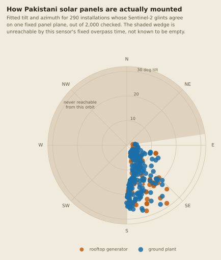

<div align="center">

# earthpv

**Open rooftop solar mapping from free satellite imagery.**

[Documentation](https://open-energy-transition.github.io/earthpv/) &nbsp;·&nbsp;
[Capacity map](https://open-energy-transition.github.io/earthpv/results/capacity/) &nbsp;·&nbsp;
[Workflow](https://open-energy-transition.github.io/earthpv/workflow/) &nbsp;·&nbsp;
[Experiments](https://open-energy-transition.github.io/earthpv/experiments/) &nbsp;·&nbsp;
[Community](https://open-energy-transition.github.io/earthpv/community/)

</div>

---

Pakistan's installed solar capacity is reported anywhere between
[6.8 GW officially and 47 GW by NGO estimates](https://ember-energy.org/latest-insights/the-solarisation-of-pakistans-energy-economy/).
Nobody can check those numbers, because the maps behind them are built on commercial
high-resolution imagery that cannot be shared and that most licences forbid processing
with AI.

earthpv takes the opposite route. It fine-tunes the open **TerraMind** geospatial
foundation model (IBM and ESA, through TerraTorch) on **Sentinel-2** imagery, which is
free, global and refreshed every five days, and it puts every detection in front of
**OpenStreetMap** mappers for verification. The verified result becomes the next round of
training data. Model, code, training labels and capacity numbers are all open.

## Key results

| | |
| --- | --- |
| **18.3 GWp** [16.9 to 21.5] | Pakistan, all PV, recall-corrected |
| **6.1 GWp** [5.6 to 7.3] | of that on rooftops |
| **114,188** | individual buildings carrying PV signal |
| **400 m²** | per-object detection floor at Sentinel-2's 10 m resolution |
| **0.18 → 0.55** | Punjab recall for arrays ≥ 1000 m², before and after in-domain training data |

<p align="center">
  
</p>

<p align="center"><em>Calibrated capacity for every building carrying PV signal in Pakistan.
The <a href="https://open-energy-transition.github.io/earthpv/results/capacity/">interactive
atlas</a> lets you switch between six defensible estimators.</em></p>

## The mapping workflow

The technical novelty is not one model. It is a loop that combines free low-resolution
imagery, an open foundation model, and human mappers working inside OpenStreetMap with the
high-resolution imagery they are already licensed to look at.

<p align="center">
  
</p>

Two licences pull in opposite directions, and the loop is what resolves them. Sentinel-2 is
free and global but coarse; Esri, Bing and Mapbox resolve individual panels but only allow
a *person* to trace from them inside the OpenStreetMap editor. So the machine only ever
reads Sentinel-2, people only ever read the high-resolution layers, and the verified
installations they map are ordinary, openly licensed OpenStreetMap features that are
legitimate training data for the next model.

That loop is measurable: adding Pakistani chips produced by it took large-array recall in
Punjab from 0.18 to 0.55. Full description:
[Workflow](https://open-energy-transition.github.io/earthpv/workflow/).

## Capabilities

**Detect individual arrays above 400 m².** Fine-tuned TerraMind-tiny, recall-first by
design, exported as ranked GeoParquet, GeoJSON and a MapRoulette challenge for human
validation. Recall on the Germany validation states is 0.83 to 0.95 depending on array
size.

**Estimate capacity below that floor.** A 200 m² array is a handful of mixed pixels, so
outlining it is not defensible but counting it is. The `density` stage integrates
calibrated probability over building footprints into MWp per building, per 0.1 degree cell
and per district, in the shape PyPSA and PyPSA-Earth consume.

**Confirm panels physically, using solar glint.** A glass-fronted panel is partly a mirror,
so it flashes into Sentinel-2 only on the geometry-predictable dates when its tilt and
azimuth bisect the sun and the sensor. Two or more mutually consistent flashes confirm PV
is present and recover how the panel is mounted.

<p align="center">
  
</p>

<p align="center"><em>Panel pose recovered from Sentinel-2 glint for 290 Pakistani
installations. <a href="https://open-energy-transition.github.io/earthpv/results/pv-pose/">Interactive
version and the sensitivity study</a>.</em></p>

**State uncertainty honestly.** Every capacity number carries a 90 percent credible
interval propagated from measured binomial counts, not from model confidence. The same
rasters support six defensible estimates, and the atlas makes you pick one on purpose.

**Run anywhere.** No pre-downloaded data is required. Labels come from live Overpass or
Overture, imagery from Planetary Computer STAC, footprints from VIDA Open Buildings for any
ISO3 code, and detection reuses the existing checkpoint until you have local training data.

## Quickstart

```bash
pixi install              # data pipeline: DuckDB, geopandas, rasterio, odc-stac
pixi install -e ml        # adds PyTorch cu126 (Pascal-safe) and TerraTorch
pixi run -e ml gpu-check

# minutes-long smoke test through every GPU stage
pixi run earthpv labels --aoi freiburg
pixi run earthpv chips  --aoi freiburg --limit 50
pixi run -e ml earthpv train --config configs/terramind_pv.yaml --smoke
pixi run -e ml earthpv evaluate --aoi freiburg --checkpoint data/models/last.ckpt
```

The pipeline is `labels → chips → train → evaluate → compose → infer → postprocess →
export`, plus `density` for capacity and `calibrate-candidates` for the precision table.
Every stage is resumable and safe to re-run. The full runbook, including operational
notes for multi-hour network-bound jobs, is in
[Reproduce](https://open-energy-transition.github.io/earthpv/reproduce/).

## What did not work

Most of what was tried here failed, and the negative results are documented because they
map where the 10 m resolution limit actually is: two-season band stacking, Sentinel-1
corner reflection, two separate routes from glint to density, roof-axis orientation
priors, and three super-resolution variants. Every one has runnable code in `scripts/`.
See [Experiments](https://open-energy-transition.github.io/earthpv/experiments/).

## Community

earthpv is the software half of **TraceTheSun**, a pilot run by
[Open Energy Transition](https://openenergytransition.org) to make PV mapping
cost-effective, verifiable, community-driven and local. The Pakistani results rest on four
OET-funded interns at the **Lahore University of Management Sciences**, led by
[Muhammad Awais](https://www.linkedin.com/in/awais307/), who do the mapping, validation and
ground-truth quadrat work.

TraceTheSun also brings together [Jake Stid](https://github.com/stidjaco/GMSEUS) of Michigan
State University and [Gabriel Kasmi](https://github.com/gabrielkasmi/deeppvmapper), and it
is open to more.

The most valuable contribution is **verified installations in OpenStreetMap**. Load the
[mapping leads](https://open-energy-transition.github.io/earthpv/results/leads/) into
MapRoulette or JOSM, check them against the high-resolution layers, and map what is real.
See [Community](https://open-energy-transition.github.io/earthpv/community/) for the
quadrat protocol and the other ways in.

## Documentation

This README is the short version. The full documentation is at
**<https://open-energy-transition.github.io/earthpv/>** and covers the
[capacity map](https://open-energy-transition.github.io/earthpv/results/capacity/),
[mapping leads](https://open-energy-transition.github.io/earthpv/results/leads/),
[panel pose](https://open-energy-transition.github.io/earthpv/results/pv-pose/),
the [detection](https://open-energy-transition.github.io/earthpv/methods/detection/),
[density](https://open-energy-transition.github.io/earthpv/methods/density/),
[glint](https://open-energy-transition.github.io/earthpv/methods/glint/) and
[calibration](https://open-energy-transition.github.io/earthpv/methods/calibration/)
methods, the [experiment log](https://open-energy-transition.github.io/earthpv/experiments/),
and the [reproduction runbook](https://open-energy-transition.github.io/earthpv/reproduce/).

Build it locally with `pixi run docs-figures && pixi run -e docs docs-serve`.

## Licence

Code MIT. Imagery from Copernicus Sentinel-2; building footprints from VIDA Open Buildings
and Overture Maps; labels from OpenStreetMap contributors under ODbL; administrative
boundaries from geoBoundaries under CC-BY.
