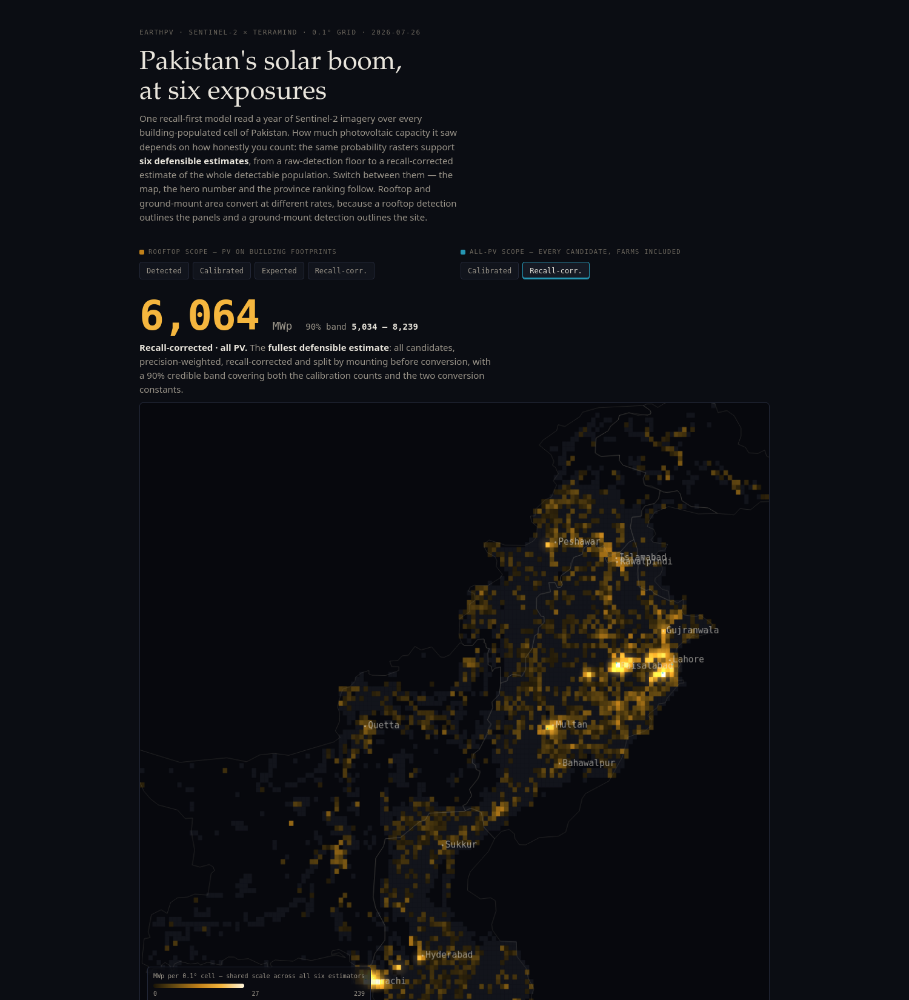

<div align="center">

<picture>
  <source media="(prefers-color-scheme: dark)" srcset="docs/assets/figures/earthpv-logo-mark-white.png">
  
</picture>

# earthpv

**Open rooftop solar mapping from free satellite imagery.**

[Documentation](https://open-energy-transition.github.io/earthpv/) &nbsp;·&nbsp;
[Capacity map](https://open-energy-transition.github.io/earthpv/results/capacity/) &nbsp;·&nbsp;
[Workflow](https://open-energy-transition.github.io/earthpv/workflow/) &nbsp;·&nbsp;
[Scale to a new country](https://open-energy-transition.github.io/earthpv/scale/) &nbsp;·&nbsp;
[Experiments](https://open-energy-transition.github.io/earthpv/experiments/) &nbsp;·&nbsp;
[Community](https://open-energy-transition.github.io/earthpv/community/)

</div>

---

> **EarthPV demonstrates how the use of free Sentinel-2 imagery, an open foundation model, and human-in-the-loop validation in OpenStreetMap can make global photovoltaic mapping more scalable, verifiable, and cost-effective than existing methods.**

EarthPV takes an innovative approach. It fine-tunes the open **TerraMind** geospatial
foundation model (IBM and ESA, through TerraTorch) on **Sentinel-2** imagery, which is
free, global and refreshed every five days, and it puts every detection in front of
**OpenStreetMap** mappers for verification. The verified result becomes the next round of
training data. Model, code, training labels and capacity numbers are all open.

**Pakistan is the first pilot, not the end.** See [scaling](#scaling-to-another-country).

## Pakistan pilot

Pakistan's installed solar capacity is reported anywhere between
[6.8 GW officially and 47 GW by NGO estimates](https://ember-energy.org/latest-insights/the-solarisation-of-pakistans-energy-economy/).
Nobody can check those numbers, because the maps behind them are built on commercial
high-resolution imagery that cannot be shared and that most licences forbid processing
with AI.

| | |
| --- | --- |
| **6.1 GWp** [5.0 to 8.2] | Pakistan, all PV ≥ 400 m², recall-corrected |
| **4.7 GWp** [3.9 to 6.1] | of that on rooftops |
| **93,120** | individual buildings carrying detected PV |
| **400 m²** | per-object detection floor at Sentinel-2's 10 m resolution |
| **0.18 → 0.55** | Punjab recall for arrays ≥ 1000 m², before and after in-domain training data |

> **Scope, stated plainly.** These are capacities for installations **at or above the
> 400 m² detection floor**. Germany's legally complete MaStR register puts 72.6 percent of
> rooftop capacity in systems of 100 kWp or less, roughly 555 m² of module, so the majority
> of real rooftop capacity is very likely *below* this floor and is not in the numbers
> above. The sub-400 m² instruments are
> [under construction, with measured skill but no published capacity yet](https://open-energy-transition.github.io/earthpv/methods/density/).

<p align="center">
  <a href="https://open-energy-transition.github.io/earthpv/results/capacity/">
    
  </a>
</p>

<p align="center"><em>The capacity atlas, one of six defensible estimators.
<a href="https://open-energy-transition.github.io/earthpv/results/capacity/">Open the
interactive version</a> to switch estimators and rank provinces by each of them.</em></p>

## The mapping workflow

The technical novelty is not one model. It is a loop that combines free low-resolution
imagery, an open foundation model, and human mappers working inside OpenStreetMap with the
high-resolution imagery they are already licensed to look at.

<p align="center">
  
</p>

Two licences pull in opposite directions, and the loop is what resolves them. Sentinel-2 is
free and global but coarse; Esri, Bing and Mapbox resolve individual panels but only allow
a *person* to trace from them inside the OpenStreetMap editor. So the machine only ever
reads Sentinel-2, people only ever read the high-resolution layers, and the verified
installations they map are ordinary, openly licensed OpenStreetMap features that are
legitimate training data for the next model.

That loop is measurable: adding Pakistani chips produced by it took large-array recall in
Punjab from 0.18 to 0.55. Full description:
[Workflow](https://open-energy-transition.github.io/earthpv/workflow/).

## Capabilities

**Detect individual arrays above 400 m².** Fine-tuned TerraMind-tiny, recall-first by
design, exported as ranked GeoParquet, GeoJSON and a MapRoulette challenge for human
validation. Recall on the Germany validation states is 0.83 to 0.95 depending on array
size.

**Aggregate that into the shape energy models consume.** The `density` stage turns
candidate polygons and probability rasters into MWp per building, per 0.1 degree cell and
per district, with credible intervals, in the shape PyPSA and PyPSA-Earth take directly.
Rooftop and ground-mount area convert at different rates, because a rooftop detection
outlines the panels and a ground-mount detection outlines the site.

**Below the floor: measured skill, no published capacity yet.** This is the project's open
front, and the honest status is that the shipped estimator barely reaches there — the whole
sub-500 m² class is 8.2 MWp of the national total, while one exhaustively mapped square
kilometre of residential Lahore holds 3.3 times more sub-100 m² PV area than the model
finds nationwide. Two instruments now do better by dropping the polygon: a per-building
classifier trained on fully-mapped quadrats reaches **0.88 AUC on roofs under 500 m²**
where the segmentation model scores 0.50, and a fraction head recovers 52 percent of true
PV area in that residential quadrat against segmentation's 2.3 percent. Neither yet
produces a published capacity number, because absolute rates do not transfer between
residential and industrial strata and four of the five quadrats are industrial estates.
See [Capacity density](https://open-energy-transition.github.io/earthpv/methods/density/).

**Confirm panels physically, using solar glint.** A glass-fronted panel is partly a mirror,
so it flashes into Sentinel-2 only on the geometry-predictable dates when its tilt and
azimuth bisect the sun and the sensor. Two or more mutually consistent flashes confirm PV
is present and recover how the panel is mounted.

<p align="center">
  <a href="https://open-energy-transition.github.io/earthpv/results/pv-pose/">
    
  </a>
</p>

<p align="center"><em>Panel pose recovered from Sentinel-2 glint for 290 Pakistani
installations, out of 2,000 checked.
<a href="https://open-energy-transition.github.io/earthpv/results/pv-pose/">Open the
interactive version</a>.</em></p>

**State uncertainty honestly.** Every capacity number carries a 90 percent credible
interval propagated from measured binomial counts, not from model confidence. The same
rasters support six defensible estimates, and the atlas makes you pick one on purpose.

## Scaling to another country

Nothing in the pipeline is Pakistan-specific. All four inputs are global open datasets:

| Input | Source | Coverage |
| --- | --- | --- |
| Imagery | Copernicus Sentinel-2 L2A | global, every five days, free |
| Labels | OpenStreetMap, live Overpass or Overture | global, wherever mappers have been |
| Footprints | VIDA Open Buildings | global, imagery-derived |
| Boundaries | geoBoundaries, CC-BY | global, ADM1 and ADM2 |

Three commands set up a region that has never been touched. The first is read-only and
tells you within a couple of minutes whether the data is actually there.

```bash
pixi run python scripts/new_region.py check --bbox 98.5,7.8,101.0,10.2 --iso3 THA
pixi run python scripts/new_region.py add   --aoi surat_thani --bbox 98.5,7.8,101.0,10.2 --iso3 THA
pixi run python scripts/new_region.py plan  --aoi surat_thani
```

`check` probes OpenStreetMap label density, VIDA availability, geoBoundaries, Sentinel-2
cloud cover in your composite window, and the compose budget. `add` writes the AOI block.
`plan` prints the ordered runbook with the region's name filled in.

A first candidate set needs no local training data: the existing checkpoint runs unchanged.
What closes the domain gap afterwards is local mapping, which is why the guide starts by
telling you to find a mapping community before you run anything. Programme targets are
Mexico, Japan, Korea, Indonesia, India, Brazil, South Africa and Nigeria; Gujarat is already
registered as a worked template.

Full guide, including what to expect by starting condition and what genuinely differs from
Pakistan (climate windows, roof type, latitude-dependent glint geometry, installation-size
distribution): **[Scale to a new country](https://open-energy-transition.github.io/earthpv/scale/)**.

## Quickstart

```bash
pixi install              # data pipeline: DuckDB, geopandas, rasterio, odc-stac
pixi install -e ml        # adds PyTorch cu126 (Pascal-safe) and TerraTorch
pixi run -e ml gpu-check

# minutes-long smoke test through every GPU stage
pixi run earthpv labels --aoi freiburg
pixi run earthpv chips  --aoi freiburg --limit 50
pixi run -e ml earthpv train --config configs/terramind_pv.yaml --smoke
pixi run -e ml earthpv evaluate --aoi freiburg --checkpoint data/models/last.ckpt
```

The pipeline is `labels → chips → train → evaluate → compose → infer → postprocess →
export`, plus `density` for capacity and `calibrate-candidates` for the precision table.
Every stage is resumable and safe to re-run. The full runbook, including operational
notes for multi-hour network-bound jobs, is in
[Reproduce](https://open-energy-transition.github.io/earthpv/reproduce/).

## What did not work

Most of what was tried here failed, and the negative results are documented because they
map where the 10 m resolution limit actually is: two-season band stacking, Sentinel-1
corner reflection, two separate routes from glint to density, roof-axis orientation
priors, and three super-resolution variants. Every one has runnable code in `scripts/`.
See [Experiments](https://open-energy-transition.github.io/earthpv/experiments/).

## Community

earthpv is the software half of **TraceTheSun**, a pilot run by
[Open Energy Transition](https://openenergytransition.org) to make PV mapping
cost-effective, verifiable, community-driven and local. The Pakistani results rest on four
OET-funded interns at the **Lahore University of Management Sciences**, led by
[Muhammad Awais](https://www.linkedin.com/in/awais307/), who do the mapping, validation, model development and
ground-truth quadrat work.

The most valuable contribution is **verified installations in OpenStreetMap**. Load the
[mapping leads](https://open-energy-transition.github.io/earthpv/results/leads/) into
MapRoulette or JOSM, check them against the high-resolution layers, and map what is real.
See [Community](https://open-energy-transition.github.io/earthpv/community/) for the
quadrat protocol and the other ways in.

## Documentation

This README is the short version. The full documentation is at
**<https://open-energy-transition.github.io/earthpv/>** and covers the
[capacity map](https://open-energy-transition.github.io/earthpv/results/capacity/),
[mapping leads](https://open-energy-transition.github.io/earthpv/results/leads/),
[panel pose](https://open-energy-transition.github.io/earthpv/results/pv-pose/),
the [detection](https://open-energy-transition.github.io/earthpv/methods/detection/),
[density](https://open-energy-transition.github.io/earthpv/methods/density/),
[glint](https://open-energy-transition.github.io/earthpv/methods/glint/) and
[calibration](https://open-energy-transition.github.io/earthpv/methods/calibration/)
methods, the [experiment log](https://open-energy-transition.github.io/earthpv/experiments/),
and the [reproduction runbook](https://open-energy-transition.github.io/earthpv/reproduce/).

Build it locally with `pixi run docs-figures && pixi run -e docs docs-serve`.

## Licence

Code MIT. Imagery from Copernicus Sentinel-2; building footprints from VIDA Open Buildings
and Overture Maps; labels from OpenStreetMap contributors under ODbL; administrative
boundaries from geoBoundaries under CC-BY.
