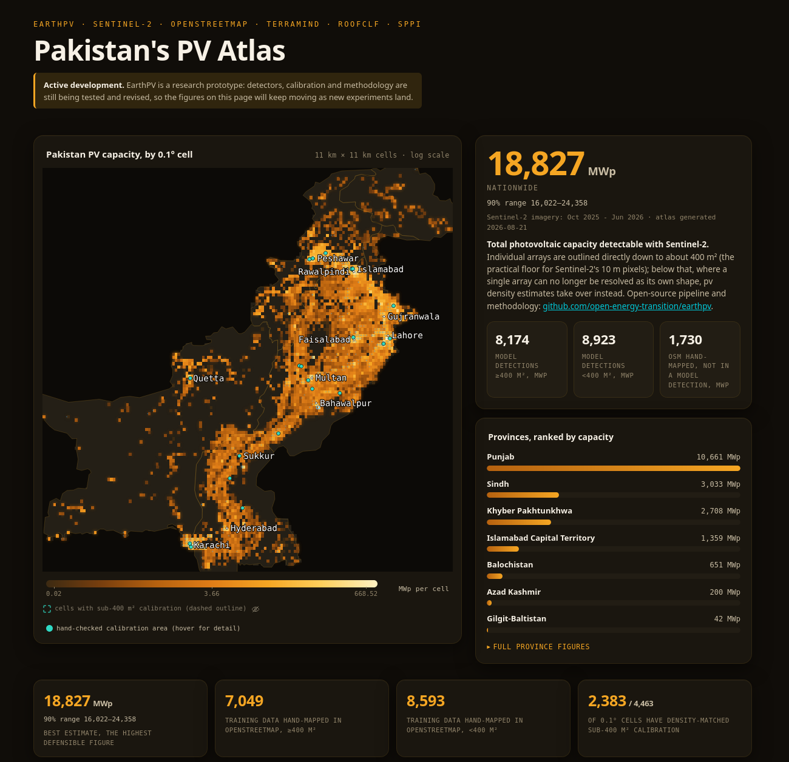
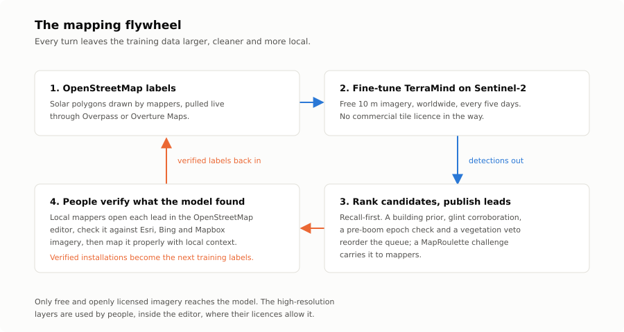

<div align="center">

<picture>
  <source media="(prefers-color-scheme: dark)" srcset="docs/assets/figures/earthpv-logo-mark-white.png">
  
</picture>

# earthpv

**Open, global (rooftop) photovoltaic mapping from free satellite imagery.**

[Documentation](https://open-energy-transition.github.io/earthpv/) &nbsp;·&nbsp;
[Capacity map](https://open-energy-transition.github.io/earthpv/results/capacity/) &nbsp;·&nbsp;
[Growth](https://open-energy-transition.github.io/earthpv/results/growth/) &nbsp;·&nbsp;
[Workflow](https://open-energy-transition.github.io/earthpv/how-it-works/#workflow) &nbsp;·&nbsp;
[Setup a new country](https://open-energy-transition.github.io/earthpv/reproduce/) &nbsp;·&nbsp;
[Experiments](https://open-energy-transition.github.io/earthpv/experiments/) &nbsp;·&nbsp;
[Community](https://open-energy-transition.github.io/earthpv/#community)

</div>

---

> **The mission of EarthPV is to provide cost-effective, verifiable, open data on photovoltaic (PV) capacity, growth and orientation for every country worldwide.**

> [!WARNING]
> **Active development.** EarthPV is a research prototype: it is actively experimenting
> with new solar detection methods, and its detectors, calibration and headline numbers
> are still being tested and revised rather than settled.

EarthPV fine-tunes the open **TerraMind** geospatial foundation model (IBM and ESA, through.
TerraTorch) on **Sentinel-2** imagery, which is free, global and refreshed every five days,
and puts every detection in front of **OpenStreetMap** mappers for verification. The
verified result becomes the next round of training data. Model, code, training labels and
capacity numbers are all open, and every input is a global dataset -- nothing here is built
on imagery or licences that only exist in one country.

**Pakistan is the first pilot, not the destination.** It is where four methods below were
built and measured; the plan is to run the same pipeline everywhere Sentinel-2 flies. See
[Scaling worldwide](#scaling-worldwide).

<p align="center">
  <a href="https://open-energy-transition.github.io/earthpv/results/capacity/">
    
  </a>
</p>

<p align="center"><em>This project's own highest defensible figure, not a bare point
estimate: hand-mapped OpenStreetMap installations, the model's own recall-corrected
detections, and a per-building density estimate for small rooftops, with a 90 percent
range attached.
<a href="https://open-energy-transition.github.io/earthpv/results/capacity/">Open the
interactive version</a>.</em></p>

## The main workflow: two detectors, split by placement and calibration coverage, one evidence atlas

This is earthpv's default pipeline and primary output. No single instrument covers
rooftop solar at every scale, so it runs two, each measured against ground truth, and
combines them into one product. The split is **not** a clean size boundary: roofclf's
reach now extends past its original sub-400 m² floor into large rooftops too, wherever
it has been calibrated to do so.

<p align="center">
  
</p>

**Segmentation, the source of every mapping lead, and of ground-mount capacity at any
size.** A fine-tuned TerraMind-tiny outlines panels directly, exported as ranked
GeoParquet, GeoJSON and a MapRoulette challenge for human validation, regardless of
array size. Recall on the Germany validation states is 0.83 to 0.95 depending on array
size; recall on Punjab rooftops went from 0.18 to 0.55 once verified in-domain training
data closed the loop. roofclf has no building footprint to classify a ground-mounted
array against, so segmentation remains the only instrument for ground-mount at any size,
and it stays the authoritative *rooftop* instrument too, everywhere roofclf has not been
calibrated (see next).

**roofclf, for every rooftop below 400 m² -- and, where calibrated, for large rooftops
too.** At 10 m resolution, a 100 m² array is a handful of mixed pixels -- not enough to
draw a polygon around, but enough to ask whether a *building* carries PV. **roofclf** is
a per-building classifier trained on 27 exhaustively mapped ground-truth quadrats (0.879
AUC, 0.834 with roof size controlled for, where the segmentation raster scores close to
chance on the same small buildings), cross-checked against **SPPI**, a zero-training
five-band spectral index (He et al. 2026) that needs no labels at all (0.823 AUC in its
own nine-quadrat evaluation, where roofclf scored 0.874 on the identical buildings). They agree often enough to raise measured precision from 0.53 to 0.63
when both flag a building, and the gain concentrates in exactly the low-adoption places
where roofclf alone is known to over-predict. Segmentation's blind spot turns out not to
be building size but *installation* size -- a small array on a large roof is invisible to
it too -- so as of 2026-08-07 roofclf's own rooftop estimate (AUC 0.896 vs segmentation's
0.73-0.78 on the identical ≥ 400 m² buildings) also *replaces* segmentation's rooftop
total at or above 400 m² inside the cells its calibration quadrats cover. Outside those
cells segmentation's own recall-corrected rooftop figure stays authoritative, since it is
the only evidence-backed number there. See
[Capacity density](https://open-energy-transition.github.io/earthpv/methods/density/).

**Both instruments converge on the evidence atlas.** `density` aggregates segmentation's
≥ 400 m² detections (rooftop and ground-mount, every cell); `roof-classifier` →
`roofclf-score-national` → `sub400-capacity` builds roofclf's < 400 m² population, and
`ge400-roof-capacity` builds its ≥ 400 m² rooftop replacement inside the calibrated
cells; `earthpv atlas` combines all of it into **Best estimate**, this project's own
highest defensible figure, hand-mapped OpenStreetMap installations plus the model's own
recall-corrected detections plus roofclf/SPPI's per-building density estimate -- with
the overlap between OSM and detections removed rather than double-counted, and a 90%
range on the total. Full command sequence:
[The full pipeline](https://open-energy-transition.github.io/earthpv/reproduce/#the-full-pipeline).

**Why two detectors, checked against a complete register.** Germany's MaStR register is
legally mandatory, so it is ground truth rather than a sample. Measured against it,
**65.5% of German rooftop capacity sits below the 400 m² detection floor** (97.2% of
installations). An instrument that only sees above that floor is describing roughly a third
of what a "rooftop solar" headline implies, which is the whole argument for the second
detector. See
[Validation against MaStR](https://open-energy-transition.github.io/earthpv/methods/mastr-validation/).

**The absolute total is a modelled estimate, not a metered figure -- Sentinel-2's 10 m
pixels make that unavoidable.** An individual array below roughly 400 m² is a mixed-pixel
problem rather than a shape the segmentation model can outline, so everything under that
floor comes from `roofclf` instead, restricted to cells whose building density resembles
the hand-mapped calibration quadrats it was measured on. That restriction keeps the
sub-400 m² numbers honest, but it also means the total tracks calibration coverage, not a
direct count, which is why the headline figure carries a 90% range rather than one bare
number.
Checked against that limitation directly: an independent, separately produced national
rooftop-solar estimate agrees closely with this project's on **where** capacity
concentrates -- normalizing both to percent of national total per spatial unit (their
absolute magnitudes aren't comparable), the median difference across 3,303 spatial units
is 0.005 percentage points and rank correlation is 0.75-0.84. It disagrees more on how
much weight the very largest sites deserve (a handful of hotspot cells drive most of the
remaining gap, consistently in the same direction), which is a real, stated limitation,
not a hidden one. See
[Capacity map](https://open-energy-transition.github.io/earthpv/results/capacity/) for the
full comparison and `scripts/pv_reference_share_comparison.py` to reproduce it.

### Optional, supplementary instruments

Everything below is evidence toward the main workflow, a secondary product built from
the same detections, or a documented negative result -- not a competing main path.

**Glint, for tilt and orientation.** A glass-fronted panel is partly a mirror, so it
flashes into Sentinel-2 only on the geometry-predictable dates when its tilt and azimuth
bisect the sun and the sensor. Two or more mutually consistent flashes are a physical
confirmation that PV is present, independent of spectral appearance, and recover how the
panel is mounted. Folds into the main workflow's leads ranking as a boost-only signal;
never required to produce the evidence atlas.

<p align="center">
  <a href="https://open-energy-transition.github.io/earthpv/glint_examples/">
    
  </a>
</p>

<p align="center"><em>The physical event the glint check looks for, caught in sub-metre
commercial imagery: the array's specular reflection is so intense it saturates the
sensor outright, blooming into a rainbow smear across the neighbouring rooftops. At
Sentinel-2's 10 m the same event is a single bright pixel-cluster on one predictable
date -- more examples in
<a href="https://open-energy-transition.github.io/earthpv/glint_examples/">What solar
glint actually looks like</a>.</em></p>

**Growth, for when installations appeared.** Diffing a pre-boom (2021/22) Sentinel-2
composite against the current one -- with both the segmentation model and SPPI run
independently on each epoch -- shows where solar capacity actually landed, not just where
it stands today. Pakistan's own rooftop stock roughly doubled since 2021/22 by this
measure. See [Growth](https://open-energy-transition.github.io/earthpv/results/growth/).

A fraction-head expected-area instrument, SPPI as a standalone (not cross-checked)
detector, an older Low/Central/High/All-PV bracket atlas and a rooftop potential/saturation
atlas exist too, each measured and each kept in the repository whether or not it was
promoted -- see
[Experiments](https://open-energy-transition.github.io/earthpv/experiments/)
for what was tried and why the main workflow above is what shipped.

## Scaling worldwide

Nothing in the pipeline is Pakistan-specific. All four inputs are global open datasets:

| Input | Source | Coverage |
| --- | --- | --- |
| Imagery | Copernicus Sentinel-2 L2A | global, every five days, free |
| Labels | OpenStreetMap, live Overpass or Overture | global, wherever mappers have been |
| Footprints | VIDA Open Buildings | global, imagery-derived |
| Boundaries | geoBoundaries, CC-BY | global, ADM1 and ADM2 |

Three commands set up a region that has never been touched. The first is read-only and
tells you within a couple of minutes whether the data is actually there.

```bash
pixi run python scripts/new_region.py check --bbox 98.5,7.8,101.0,10.2 --iso3 THA
pixi run python scripts/new_region.py add   --aoi surat_thani --bbox 98.5,7.8,101.0,10.2 --iso3 THA
pixi run python scripts/new_region.py plan  --aoi surat_thani
```

`check` probes OpenStreetMap label density, VIDA availability, geoBoundaries, Sentinel-2
cloud cover in your composite window, and the compose budget. `add` writes the AOI block.
`plan` prints the ordered runbook with the region's name filled in.

A first candidate set needs no local training data: the existing checkpoint runs unchanged.
What closes the domain gap afterwards is local mapping, which is why the guide starts by
telling you to find a mapping community before you run anything. **Programme targets are
Mexico, Japan, Korea, Indonesia, India, Brazil, South Africa and Nigeria**; Gujarat is
already registered as a worked template, with a first full, segmentation-only capacity
estimate (812.6 MWp, ≥ 400 m², no calibration quadrats yet) at
[Gujarat capacity map](https://open-energy-transition.github.io/earthpv/results/gujarat/).

Full guide, including what to expect by starting condition and what genuinely differs from
Pakistan (climate windows, roof type, latitude-dependent glint geometry, installation-size
distribution): **[Setup a new country](https://open-energy-transition.github.io/earthpv/reproduce/)**.

## Pakistan: the pilot, in numbers

Pakistan's installed solar capacity is reported anywhere between
[6.8 GW officially and 47 GW by NGO estimates](https://ember-energy.org/latest-insights/the-solarisation-of-pakistans-energy-economy/).
Nobody can check those numbers, because the maps behind them are built on commercial
high-resolution imagery that cannot be shared and that most licences forbid processing
with AI. earthpv's own numbers come from
[the main workflow](#the-main-workflow-two-detectors-split-by-placement-and-calibration-coverage-one-evidence-atlas)
above:

| | |
| --- | --- |
| **18,827 MWp** | Best estimate: this project's own highest defensible figure (90% range 16,022 &ndash; 24,358) |
| **15,642** | individual installations hand-mapped in OpenStreetMap (deduplicated -- see below) |
| **400 m²** | size below which segmentation is trained blind; roofclf/SPPI cover it, and roofclf also replaces segmentation above it inside its calibrated cells |
| **65.5%** | of Germany's rooftop capacity sits *below* that floor, measured against its complete MaStR register |

The headline figure carries a 90% range as of 2026-08-11, composed from the
area-to-capacity constants' priors, segmentation's measured precision and recall by
installation size, and the coverage ratio's sensitivity to which calibration quadrats happen
to have been mapped. The range is wide on purpose: this figure moved by 20-35% five times in
a single week from recalibration alone, and reporting it bare had been hiding that. It is not
a design-based margin of error -- the quadrats behind it are hand-picked, not randomly
sampled, and it does not cover the gap between where the roofclf coverage-ratio correction is
fit and where it is applied: about half of Best is priced by a multiplier measured on
quadrats several times denser than most of the cells it prices (see [Calibration density
mismatch](https://open-energy-transition.github.io/earthpv/issues/roofclf-calibration-density-mismatch/)).
See
[Capacity map](https://open-energy-transition.github.io/earthpv/results/capacity/) for the
derivation and
[Validation against MaStR](https://open-energy-transition.github.io/earthpv/methods/mastr-validation/)
for what a legally complete register can and cannot settle.

Every number above carries the same caveat: **this is a screening and estimation layer,
not a register**. No human has validated most of it at scale, and the sub-400 m² share of
Best estimate in particular is restricted to a small, density-matched slice of the
country, not a national measurement. See
[Capacity map](https://open-energy-transition.github.io/earthpv/results/capacity/) for how
the estimate is derived and what it does and does not claim.

## The OpenStreetMap mapping loop

The technical novelty is not one model. It is a loop that combines free low-resolution
imagery, an open foundation model, and human mappers working inside OpenStreetMap with the
high-resolution imagery they are already licensed to look at.

<p align="center">
  
</p>

Two licences pull in opposite directions, and the loop is what resolves them. Sentinel-2 is
free and global but coarse; Esri, Bing and Mapbox resolve individual panels but only allow
a *person* to trace from them inside the OpenStreetMap editor. So the machine only ever
reads Sentinel-2, people only ever read the high-resolution layers, and the verified
installations they map are ordinary, openly licensed OpenStreetMap features that are
legitimate training data for the next model. Full description:
[Workflow](https://open-energy-transition.github.io/earthpv/how-it-works/#workflow).

<p align="center">
  <a href="https://open-energy-transition.github.io/earthpv/results/pv-pose/">
    
  </a>
</p>

<p align="center"><em>Panel pose recovered from Sentinel-2 glint for 290 Pakistani
installations, out of 2,000 checked.
<a href="https://open-energy-transition.github.io/earthpv/results/pv-pose/">Open the
interactive version</a>.</em></p>

## Quickstart

```bash
pixi install              # data pipeline: DuckDB, geopandas, rasterio, odc-stac
pixi install -e ml        # adds PyTorch cu126 (Pascal-safe) and TerraTorch
pixi run -e ml gpu-check

# minutes-long smoke test through every GPU stage
pixi run earthpv labels --aoi freiburg
pixi run earthpv chips  --aoi freiburg --limit 50
pixi run -e ml earthpv train --config configs/terramind_pv.yaml --smoke
pixi run -e ml earthpv evaluate --aoi freiburg --checkpoint data/models/last.ckpt
```

The main workflow is `labels → chips → train → evaluate → compose → infer →
postprocess → export` to produce every mapping lead and, via `density →
check-density`, segmentation's own ≥ 400 m² capacity; then `roof-classifier →
roofclf-score-national → sub400-capacity` for roofclf's < 400 m² population and
`ge400-roof-capacity` for its ≥ 400 m² rooftop replacement inside the calibrated cells;
`atlas` combines all of it into the evidence atlas -- this project's primary output.
Every stage is resumable and safe to re-run. The full runbook, including how to bring up
a country that has never been touched, is in
[Setup a new country](https://open-energy-transition.github.io/earthpv/reproduce/#the-full-pipeline).

## What did not work

Most of what was tried here failed, and the negative results are documented because they map
where the 10 m resolution limit actually is: two-season band stacking (including a retry
stacking the actual pre-boom epoch instead of a weather season), Sentinel-1 corner
reflection, two separate routes from glint to density, roof-axis orientation priors, three
super-resolution variants, spectral unmixing, temporal features for the roof classifier, and
two retrains aimed at known failure modes that won in-sample and lost on held-out data.
Every one has runnable code in `scripts/`.

The full register, with a verdict and the measurement behind each, is
[Experiments](https://open-energy-transition.github.io/earthpv/experiments/); what is still
undecided is
[Open questions](https://open-energy-transition.github.io/earthpv/open-questions/).

One negative result worth singling out, because it constrains how anyone should read
OpenStreetMap-derived PV numbers including this project's own: **German OSM is only 3.6%
complete for rooftop PV by unit count**, measured against the MaStR register. "Germany is
well mapped in OpenStreetMap" is true of buildings and false of rooftop solar.

## Community

earthpv is the software half of **TraceTheSun**, a pilot run by
[Open Energy Transition](https://openenergytransition.org) to make PV mapping
cost-effective, verifiable, community-driven and local, worldwide. The concept was
conceived by [Muhammad Awais](https://www.linkedin.com/in/awais307/) and Tobias. The
Pakistani results rest on a student team at the **[Centre for Water Informatics and
Technology (WIT)](https://wit.lums.edu.pk/)**, Lahore University of Management Sciences --
[Laeeba Hafeez Malik](https://www.linkedin.com/in/laeeba-hafeez-malik-220b63328/) (BS
Computer Science), [Tayyiba Shafiq](https://www.linkedin.com/in/tayyiba-shafiq/) (BS
Economics), [Nimra Aamir Ali](https://www.linkedin.com/in/nimra-aamir-ali-417b98249/) (BS
Anthropology) and [Vania Malik](https://www.linkedin.com/in/vania-malik-799bbb343/) (BS
Electrical Engineering) -- who coordinated closely
with OET to co-design the pipeline and do the mapping, validation, model development and
ground-truth quadrat work that makes the pilot's numbers checkable. For WIT the effort is
also a step toward linking the resulting national PV database into energy and power-system
models and integrated-assessment scenarios.

The most valuable contribution is **verified installations in OpenStreetMap**, in any
country. Load the
[mapping leads](https://open-energy-transition.github.io/earthpv/results/leads/) into
MapRoulette or JOSM, check them against the high-resolution layers, and map what is real.
See [Community](https://open-energy-transition.github.io/earthpv/#community) for the
quadrat protocol, the current partner list, and the other ways in.

## Documentation

This README is the short version. The full documentation is at
**<https://open-energy-transition.github.io/earthpv/>**, organised so the working pipeline
comes first and the history last:

- **Results** -- [capacity map](https://open-energy-transition.github.io/earthpv/results/capacity/),
  [mapping leads](https://open-energy-transition.github.io/earthpv/results/leads/),
  [growth map](https://open-energy-transition.github.io/earthpv/results/growth/),
  [panel pose](https://open-energy-transition.github.io/earthpv/results/pv-pose/).
- **How it works** -- the pipeline as it runs today, plus reference pages for
  [detection](https://open-energy-transition.github.io/earthpv/methods/detection/),
  [density](https://open-energy-transition.github.io/earthpv/methods/density/),
  [calibration](https://open-energy-transition.github.io/earthpv/methods/calibration/),
  [MaStR validation](https://open-energy-transition.github.io/earthpv/methods/mastr-validation/),
  the [quadrats](https://open-energy-transition.github.io/earthpv/methods/calibration-quadrats/)
  and [glint](https://open-energy-transition.github.io/earthpv/methods/glint/).
- **[Setup a new country](https://open-energy-transition.github.io/earthpv/reproduce/)** -- the runbook.
- **[Experiments](https://open-energy-transition.github.io/earthpv/experiments/)** and
  **[Open questions](https://open-energy-transition.github.io/earthpv/open-questions/)** --
  what was tried and what it cost, and what is still unresolved.

Build it locally with `pixi run docs-figures && pixi run -e docs docs-serve`.

## Licence

Code MIT. Imagery from Copernicus Sentinel-2; building footprints from VIDA Open Buildings
and Overture Maps; labels from OpenStreetMap contributors under ODbL; administrative
boundaries from geoBoundaries under CC-BY.

**Published data outputs** (the evidence atlas, capacity parquets, raw detections and any
other derived dataset offered for download, e.g. under "Download the underlying data" on the
atlas page or as a GitHub Release asset) are derivative databases of OpenStreetMap's
ODbL-licensed solar labels and, via VIDA Open Buildings, of Microsoft/Google building
footprints. Under ODbL's share-alike clause, **these data releases are themselves licensed
under the [Open Database License (ODbL) v1.0](https://opendatacommons.org/licenses/odbl/1-0/)**,
with attribution to &copy; OpenStreetMap contributors required on any use, alongside VIDA Open
Buildings (CC BY 4.0) for the footprints and, for anything derived from the Germany/MaStR
validation, the Marktstammdatenregister (Bundesnetzagentur, [Datenlizenz Deutschland -- Namensnennung -- Version
2.0](https://www.govdata.de/dl-de/by-2-0)).
