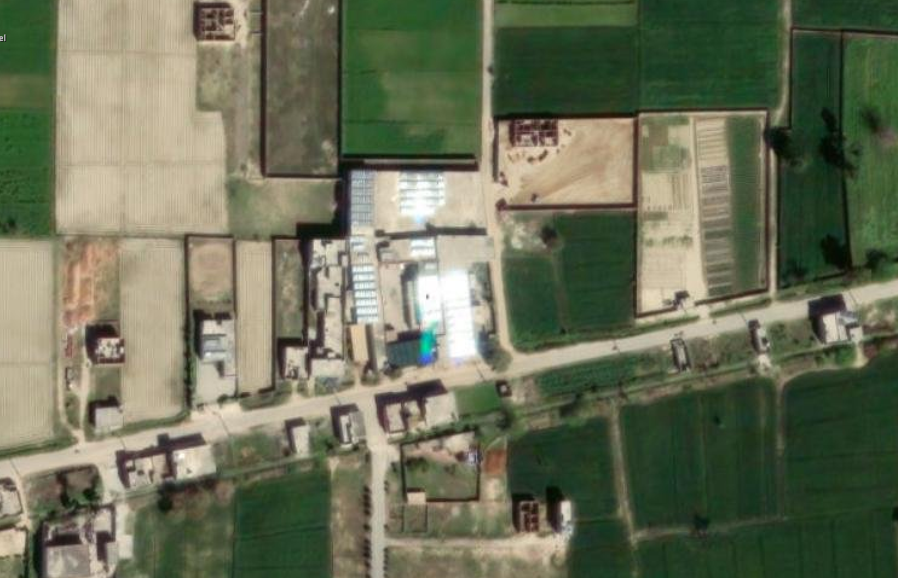
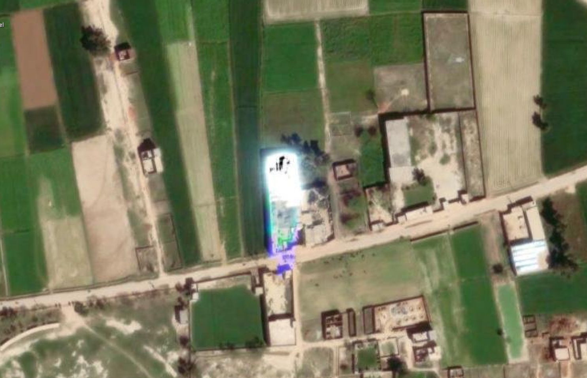
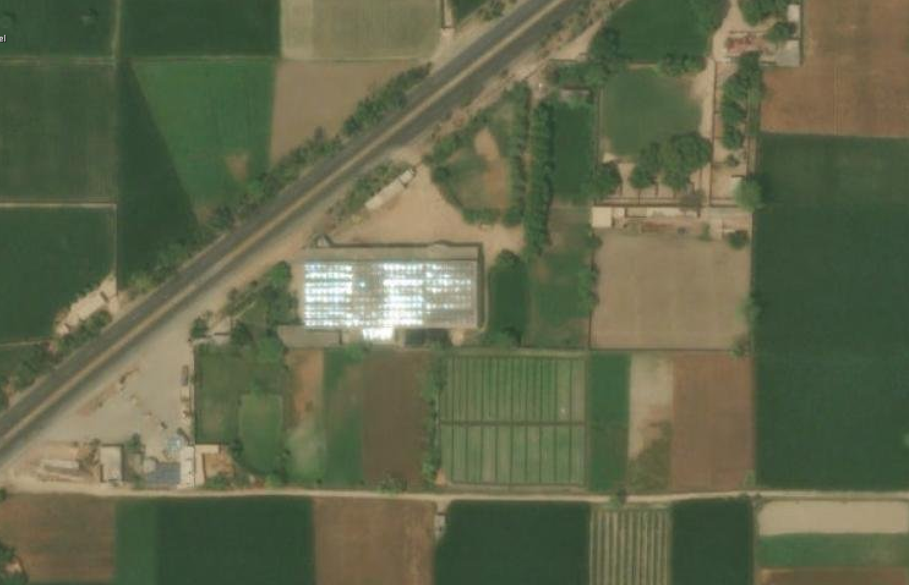
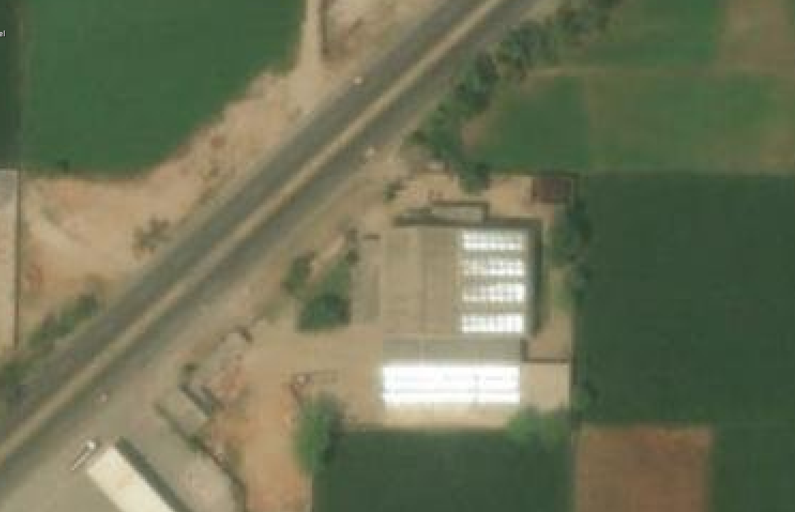
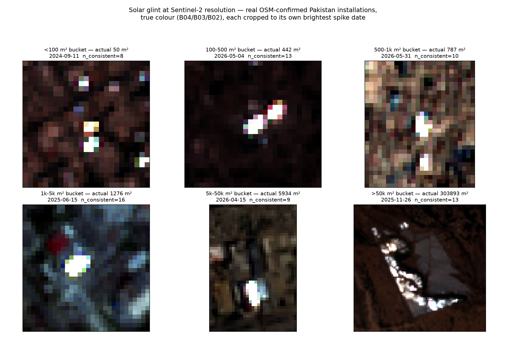

# What solar glint actually looks like

`earthpv` corroborates candidates with a physics-based check (`src/earthpv/glint.py`,
used by `postprocess --check-glint`): a glass-fronted PV panel is partly a specular
mirror, so on the rare dates its tilt happens to bisect the sun and Sentinel-2's
near-nadir sensor, it reflects a sudden burst of light straight back at the satellite —
a *glint*. See the "Solar-glint corroboration" section of the main [README](../README.md)
for how the resulting spike is scored.

This page collects visual examples of the same phenomenon at two very different
resolutions: sub-metre commercial imagery, where you can see the panels themselves
blow out white or throw a rainbow sheen, and Sentinel-2's 10 m pixels, where the
identical physical event shows up as a single bright pixel-cluster on one specific day
and nowhere else in a two-year archive.

## High-resolution reference (ESRI World Imagery)

Six real rooftop PV installations, captured in commercial high-resolution basemap
imagery at the moment their glass caught direct sun glare. These are what the Sentinel-2
detections below are physically standing in for — the same reflective event, just far
too small and fleeting to resolve at 10 m without knowing where and when to look.

| | |
|---|---|
|  |  |
| **1.** Rural rooftop array, partially blown out white with a faint blue/teal sheen at one edge — the classic saturated-highlight signature. | **2.** An elongated rooftop array along a road showing the full rainbow: white saturation fading through teal, blue and violet where the reflection angle grades across the panel surface. |
|  |  |
| **3.** A large shed-roof array beside a road — alternating bright and dark stripes, because individual panel *rows* are angled slightly differently and only some of them catch the specular condition at this exact moment. | **4.** The same array; note how sharply the glint is localized to specific rows rather than washing out the whole roof, exactly the row-level orientation dependence `fit_best_orientation` models. |
|  |  |
| **5.** A split rooftop installation: one section fully saturated, the adjacent section only partially lit — a visible example of why absence of glint on part of an array is not evidence against the rest of it. | **6.** A dense village of ordinary rooftops, where a single small PV installation stands out as an unmistakable bright patch against the uniformly dull surrounding roof material — the cue the whole method exploits. |

## The same phenomenon at Sentinel-2 resolution

The grid below is built directly from the pipeline's own validation data — no
illustrative or synthetic imagery. For each of the six installation-size buckets from
the 500-target Pakistan study (`results/glint_validation_pakistan/REPORT.md`), it takes
the most strongly-validated real, OSM-confirmed installation (highest mutually-consistent
spike count) and renders a true-colour (B04/B03/B02) Sentinel-2 crop for the exact date
its own reflectance spike was measured — the single frame, out of a ~2-year, 130-280
scene archive per site, where the glint actually happened.



Read as a set, these six panels are the visual version of the study's headline result:
the bright cluster is a handful of saturated pixels against a dark, uniform background
in every bucket, but it only reliably *fills* the installation's footprint once that
footprint is many pixels wide — which is exactly why per-installation detection climbs
from 6% below 100 m² to 73% above 50,000 m² (README, "Solar-glint corroboration"). The
>50k m² panel (bottom right) shows this most clearly: the glint traces the actual winding
layout of a utility-scale plant, pixel by pixel.

Reproducible end-to-end from cached validation data (no fresh Sentinel-2 pulls needed to
pick the examples, only to fetch the six display crops):

```bash
.pixi/envs/default/bin/python scripts/glint_s2_example_grid.py
```
