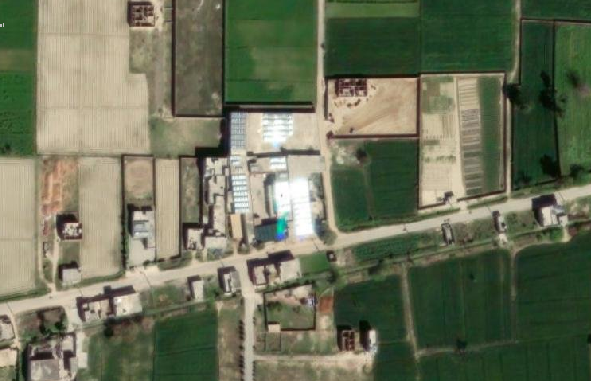
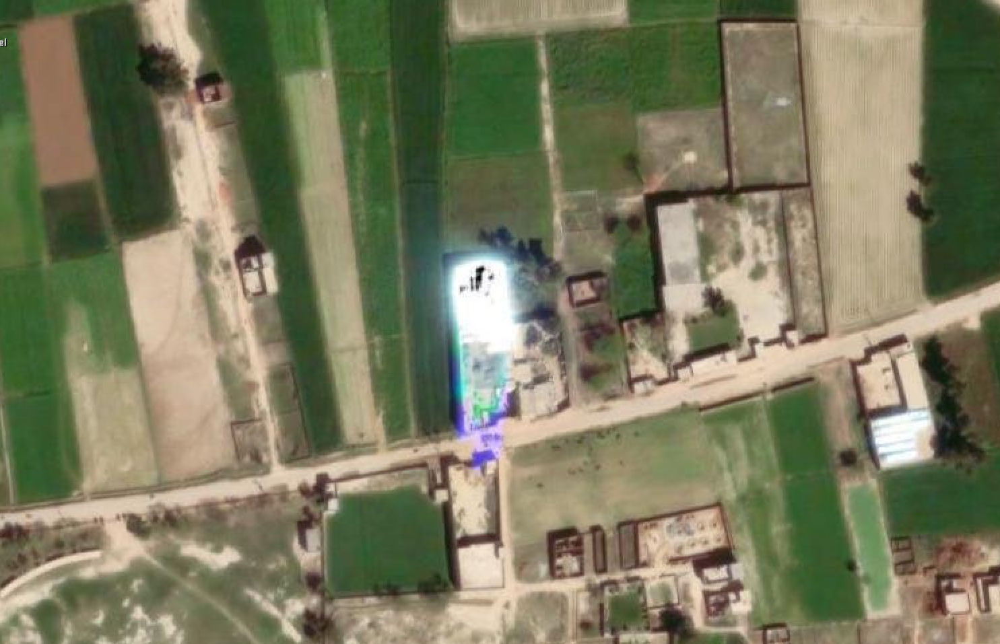
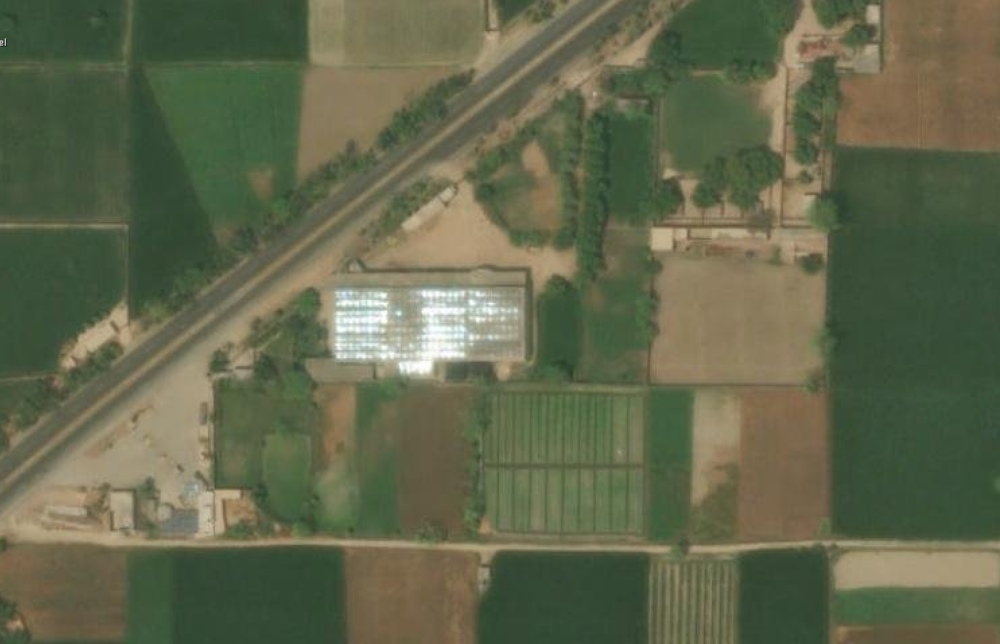
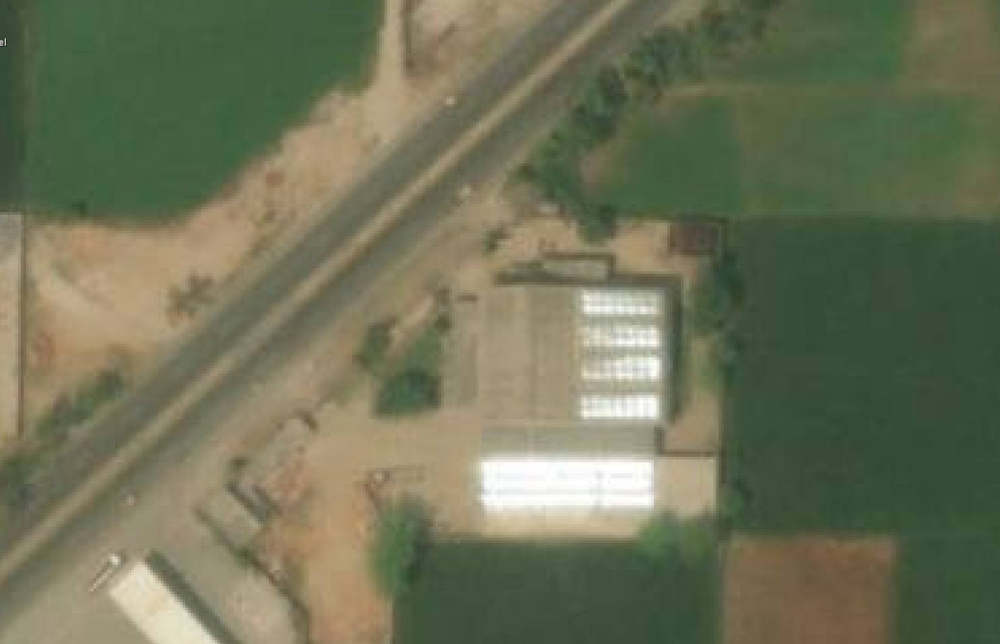
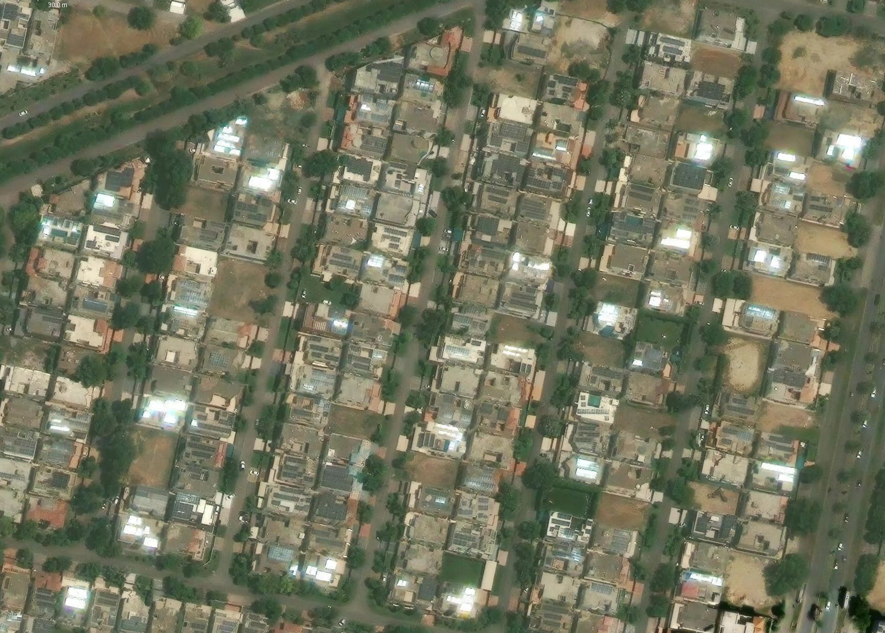
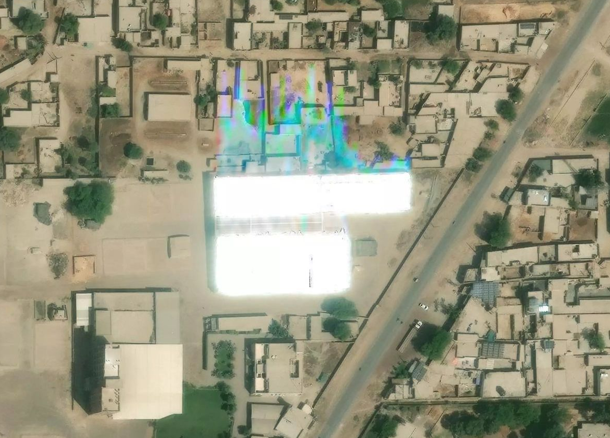
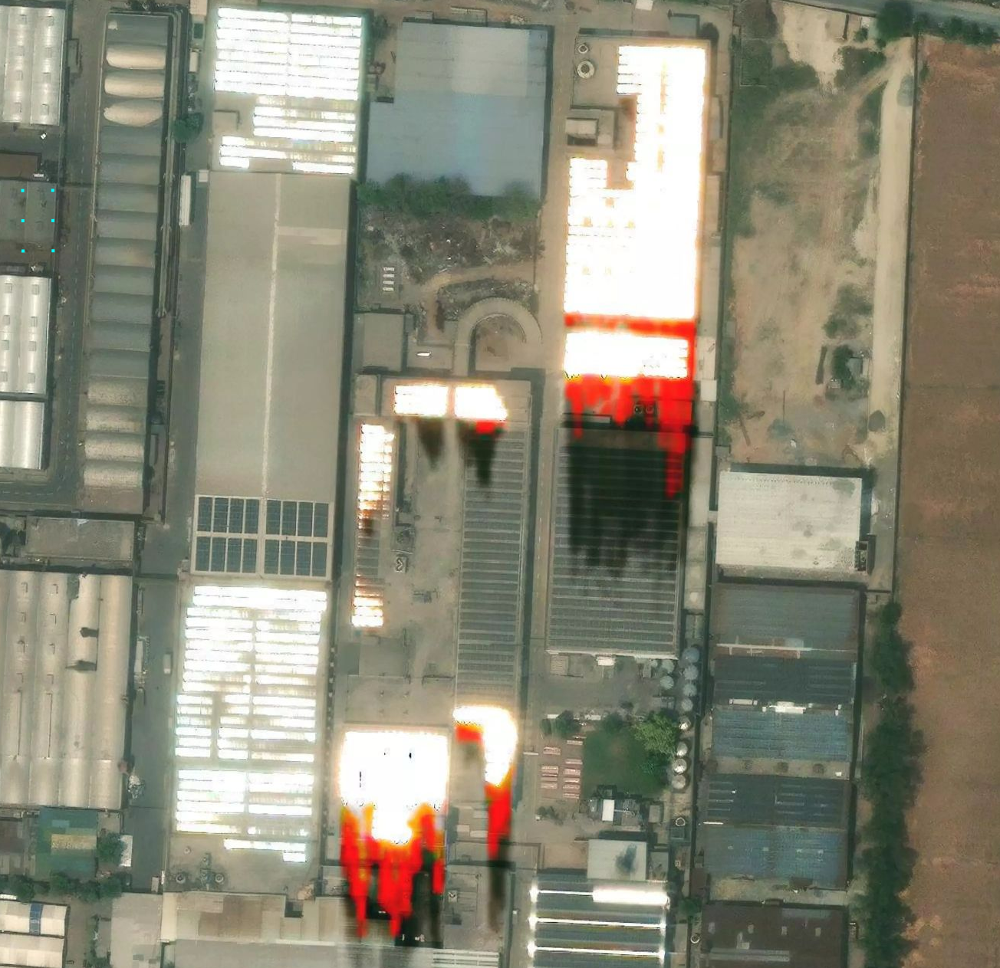
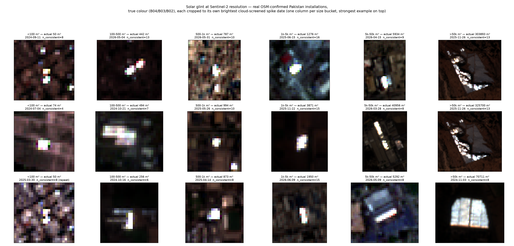

# What solar glint actually looks like

`earthpv` corroborates candidates with a physics-based check (`src/earthpv/glint.py`,
used by `postprocess --check-glint`): a glass-fronted PV panel is partly a specular
mirror, so on the rare dates its tilt happens to bisect the sun and Sentinel-2's
near-nadir sensor, it reflects a sudden burst of light straight back at the satellite:
a *glint*. See [Solar glint](methods/glint.md) for how the resulting spike is scored, and
[Panel pose from glint](results/pv-pose.md) for what the country-wide survey found.

This page collects visual examples of the same phenomenon at two very different
resolutions: sub-metre commercial imagery, where you can see the panels themselves
blow out white or throw a rainbow sheen, and Sentinel-2's 10 m pixels, where the
identical physical event shows up as a single bright pixel-cluster on one specific day
and nowhere else in a two-year archive.

## High-resolution reference (ESRI World Imagery)

Eight real rooftop PV installations, captured in commercial high-resolution basemap
imagery at the moment their glass caught direct sun glare. These are what the Sentinel-2
detections below are physically standing in for: the same reflective event, just far
too small and fleeting to resolve at 10 m without knowing where and when to look.

| | |
|---|---|
|  |  |
| **1.** Rural rooftop array, partially blown out white with a faint blue/teal sheen at one edge, the classic saturated-highlight signature. | **2.** An elongated rooftop array along a road showing the full rainbow: white saturation fading through teal, blue and violet where the reflection angle grades across the panel surface. |
|  |  |
| **3.** A large shed-roof array beside a road, alternating bright and dark stripes, because individual panel *rows* are angled slightly differently and only some of them catch the specular condition at this exact moment. The glint stays sharply localized to those rows rather than washing out the whole roof, which is the row-level orientation dependence `fit_best_orientation` models. | **4.** A split rooftop installation: one section fully saturated, the adjacent section only partially lit. A visible example of why absence of glint on part of an array is not evidence against the rest of it. |
|  |  |
| **5.** A dense village of ordinary rooftops, where a single small PV installation stands out as an unmistakable bright patch against the uniformly dull surrounding roof material, the cue the whole method exploits. | **6.** A residential block next to LUMS, Lahore, where several rooftops along the same street glint at once -- independent installations, not one array's brightness bleeding into its neighbours, consistent with nearby installers following a similar mounting tilt and orientation. |
|  |  |
| **7.** A glint so intense it damages the image itself: the array saturates fully white and the overload spills off the roof as a rainbow smear of detector-blooming artifacts trailing across the neighbouring buildings. The colour fringes are in the sensor, not on the ground -- the reflected beam exceeded what the imaging chain could record. | **8.** An industrial estate where several large roofs saturate at once, with red-channel bleed and dark ghost trails streaking off the brightest arrays -- extreme over-saturation artifacts from the commercial sensor's read-out. The same specular event that registers as a few bright pixels at Sentinel-2's 10 m here overwhelms a sub-metre instrument outright. |

## The same phenomenon at Sentinel-2 resolution

The grid below is built directly from the pipeline's own validation data. No
illustrative or synthetic imagery. For each of the six installation-size buckets from
the 500-target Pakistan study (`results/glint_validation_pakistan/REPORT.md`), it takes
up to three of the most strongly-validated real, OSM-confirmed installations (highest
mutually-consistent spike count) and renders a true-colour (B04/B03/B02) Sentinel-2 crop
for the exact date each one's own reflectance spike was measured: the frame, out of a
~2-year, 130-280 scene archive per site, where the glint actually happened. Every
candidate date is cross-checked live against Sentinel-2's per-pixel cloud layer
(`glint._scl_cloud_row`) before it is accepted, specifically because an earlier version of
this grid showed one cloud misread as a glint -- see `scripts/glint_s2_example_grid.py`'s
own docstring for the exact mechanism and the fix. The `<100` and `100-500` m² buckets
have only 2 and 7 validated installations in the whole 500-target sample, so a couple of
cells reuse an installation already shown elsewhere in that column at a second clean
spike date rather than leaving a cell blank; those are marked `(repeat)` in the caption.
Each caption's third line gives that crop's own coordinates.



Read as a set, these eighteen crops are the visual version of the study's headline result:
the bright cluster is a handful of saturated pixels against a dark, uniform background
in every bucket, but it only reliably *fills* the installation's footprint once that
footprint is many pixels wide, which is exactly why per-installation detection climbs
from 6% below 100 m² to 73% above 50,000 m² ([sensitivity curve](results/pv-pose.md)). The
>50k m² column (rightmost) shows this most clearly: the glint traces the actual outline
of a utility-scale installation, pixel by pixel.

Reproducible end-to-end from cached validation data (no fresh Sentinel-2 pulls needed to
rank the candidates, only to cross-check clouds and fetch the eighteen display crops):

```bash
.pixi/envs/default/bin/python scripts/glint_s2_example_grid.py
```
