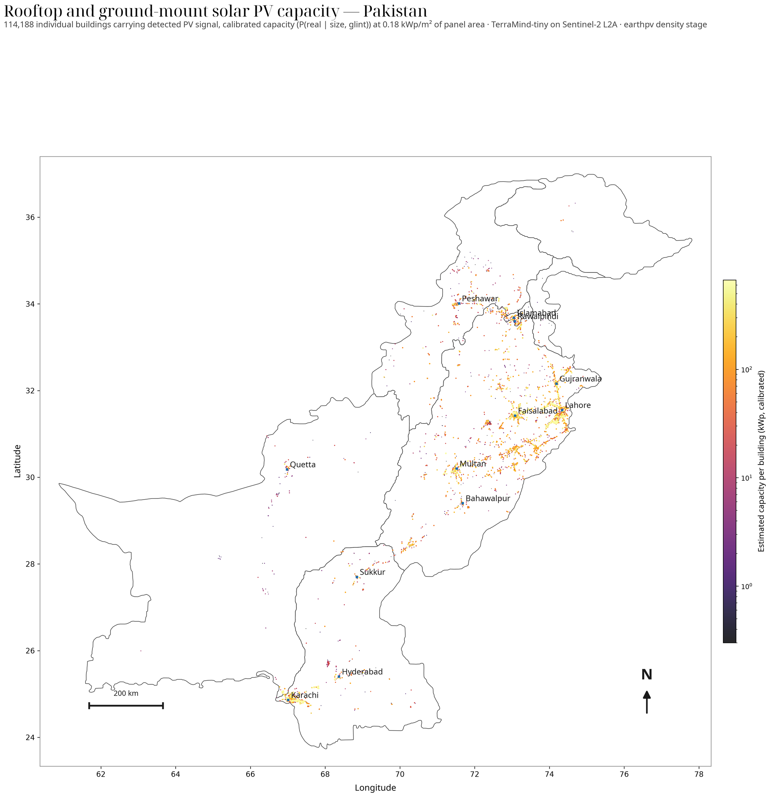

# earthpv

**Open rooftop solar mapping from free satellite imagery.**
{ .lede }

Pakistan's installed solar capacity is reported anywhere between
[6.8 GW officially and 47 GW by NGO estimates](https://ember-energy.org/latest-insights/the-solarisation-of-pakistans-energy-economy/).
Nobody can check those numbers, because the maps behind them are built on commercial
high-resolution imagery that cannot be shared and cannot legally be processed by anyone else.

earthpv takes the opposite route. It fine-tunes the open **TerraMind** geospatial foundation
model on **Sentinel-2** imagery, which is free, global and refreshed every five days, and it
puts every detection in front of **OpenStreetMap** mappers for verification. The verified
result becomes the next round of training data. Everything, including the model weights and
the capacity numbers, is open and reproducible.

18.3 GWpPakistan, all PV, recall-corrected

6.1 GWpof that on rooftops

114,188buildings carrying PV signal

400 m&sup2;per-object detection floor

## What the map looks like

/// caption
Calibrated capacity for every building carrying PV signal in Pakistan.
The [interactive version](results/capacity.md) lets you switch between six defensible
estimators and rank provinces by each of them.
///

## What is new here

**Sentinel-2 can do more than utility-scale.** Earlier work using free 10 m imagery could
only find large, isolated solar farms. Fine-tuning a foundation model on dense
OpenStreetMap labels pushes reliable per-object detection down to about
**400 m2**, which reaches commercial rooftops and large residential arrays.

**Below that floor, count instead of outline.** A 200 m2 array is a handful of
mixed pixels; drawing a polygon around it is not defensible. Summing calibrated
probability over building footprints is. That is the
[density stage](methods/density.md), and it is what produces the capacity atlas.

**Panels give themselves away by glinting.** A glass-fronted panel is partly a mirror.
Sentinel-2 views close to nadir, so a fixed panel flashes into the sensor only on the
few dates when its tilt and azimuth happen to bisect the sun and the satellite. Those
dates are predictable, which makes a glint a physical, geometry-checkable confirmation
that PV is present, and a measurement of
[how the panel is mounted](results/pv-pose.md).

**The map improves itself.** Detections go to mappers as a MapRoulette challenge;
verified installations come back as in-domain training labels. That
[flywheel](workflow.md) is the reason a model trained on Germany now works in Punjab.

## Where to go next

| If you want to | Read |
| --- | --- |
| See the capacity numbers and interrogate them | [Capacity map](results/capacity.md) |
| Understand the community mapping loop | [Workflow](workflow.md) |
| Know how detection and density actually work | [Detection](methods/detection.md), [Density](methods/density.md) |
| See what was tried and what failed | [Experiments](experiments.md) |
| Run the whole thing yourself | [Reproduce](reproduce.md) |
| Join the effort | [Community](community.md) |
| Read the one-page version | the [README](https://github.com/open-energy-transition/earthpv#readme) in the repository |

## Credits

earthpv is developed by [Open Energy Transition](https://openenergytransition.org) as part of
the **TraceTheSun** pilot, with four interns from the **Lahore University of Management
Sciences** doing the Pakistani mapping and validation work. See
[Community](community.md) for the full partner list, and the
[TraceTheSun concept note](22072026-Concept-Note-TraceTheSun.md) for the programme behind it.
