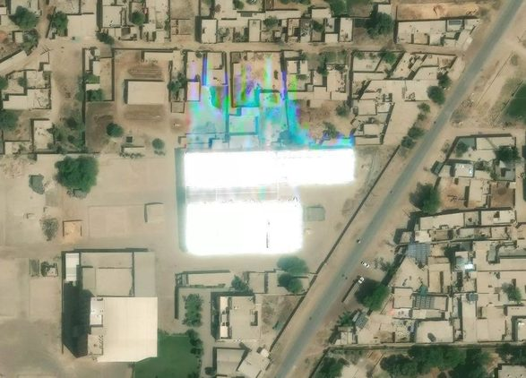
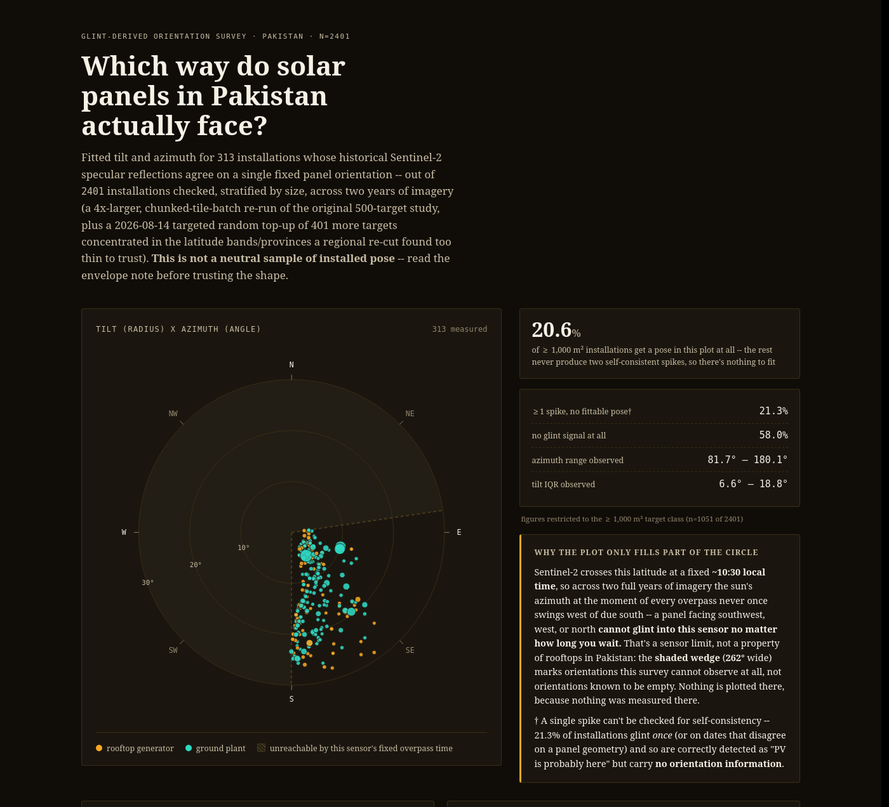

---
hide:
  - navigation
---

# earthpv

<div class="hero" markdown>

{ .hero-logo }
{ .hero-logo }

**Open, global photovoltaic mapping from free satellite imagery.**
{ .lede }

</div>


> **The mission of EarthPV is to provide cost-effective, verifiable, open data on photovoltaic (PV) capacity, growth and orientation for every country worldwide.**


!!! warning "Active development"
    EarthPV is still a research prototype. It is actively experimenting with new solar
    detection methods, and its detectors, calibration and headline numbers are still being
    tested and revised rather than settled.


EarthPV fine-tunes the open **TerraMind** geospatial foundation model, developed by IBM and ESA and accessed through TerraTorch, using **Sentinel-2** imagery. Sentinel-2 provides free, global coverage with imagery refreshed every five days. Each model detection is then presented to **OpenStreetMap** mappers for verification, and the verified results are fed back into subsequent rounds of training. The model, code, training labels, and capacity estimates are all openly available, and every input is derived from globally accessible datasets. As a result, the approach does not depend on imagery, proprietary licences, or data sources that are restricted to any single country. 

**Pakistan is the first pilot, not the destination.** It is where four methods below were
built and measured; the plan is to run the same pipeline everywhere Sentinel-2 flies. See
[Scaling worldwide](#scaling-worldwide).

[](results/capacity.md)

*This project's own highest defensible figure, not a bare point estimate: hand-mapped
OpenStreetMap installations, the model's own recall-corrected detections, and a
per-building density estimate for small rooftops, with a 90 percent range attached.
[Open the interactive version](results/capacity.md).*

## The Main Workflow

This is earthpv’s default pipeline and primary output. It combines two detectors, each evaluated against ground truth, into a single evidence atlas. Their roles are divided by installation placement and calibration coverage rather than by a strict size threshold. In particular, `roofclf` now extends beyond its original sub-400 m² range to larger rooftops wherever calibration supports its use.

![The evidence atlas workflow: Sentinel-2 imagery, OpenStreetMap solar mapping and VIDA building footprints feed two detectors, TerraMind segmentation for arrays of 400 square metres and above plus all ground-mount, and the per-building roofclf classifier cross-checked with SPPI. Both are calibrated against 30 hand-mapped ground-truth quadrats, then combined one best instrument per component with overlaps removed and each cell floored at hand-mapped OSM plus roofclf-and-SPPI agreement, producing the published evidence atlas: Best estimate 18,827 MWp with a 90 percent range of 16,022 to 24,358.](assets/figures/evidence_workflow.svg#only-light)
![The evidence atlas workflow: Sentinel-2 imagery, OpenStreetMap solar mapping and VIDA building footprints feed two detectors, TerraMind segmentation for arrays of 400 square metres and above plus all ground-mount, and the per-building roofclf classifier cross-checked with SPPI. Both are calibrated against 30 hand-mapped ground-truth quadrats, then combined one best instrument per component with overlaps removed and each cell floored at hand-mapped OSM plus roofclf-and-SPPI agreement, producing the published evidence atlas: Best estimate 18,827 MWp with a 90 percent range of 16,022 to 24,358.](assets/figures/evidence_workflow.dark.svg#only-dark)

### Segmentation

A fine-tuned TerraMind-tiny model detects and outlines rooftop and ground-mounted PV installations above approximately 400 m². These detections provide the mapping leads used throughout EarthPV and form the basis of ground-mounted capacity estimates at all relevant sizes.

### Roof-level classification

`roofclf` addresses the part of the rooftop population that segmentation cannot reliably resolve. At Sentinel-2’s 10 m spatial resolution, a 100 m² array occupies only a handful of mixed pixels. This is insufficient to delineate a polygon reliably, but it can still provide enough information to determine whether a building hosts PV.

`roofclf` is a per-building classifier trained on 30 exhaustively mapped ground-truth quadrats. It achieves an AUC of 0.879, or 0.834 after controlling for roof size, while the segmentation raster performs close to chance on the same small buildings. Its predictions are cross-checked against SPPI, a zero-training five-band spectral index introduced by He et al. (2026). In SPPI’s own nine-quadrat evaluation, SPPI achieved an AUC of 0.823, while `roofclf` reached 0.874 on the identical buildings.

Although originally introduced for rooftops below 400 m², `roofclf` is also used for larger rooftops where sufficient calibration data supports its application.


### Building the evidence atlas

The two detection streams are combined into a single capacity estimate:

- `density` aggregates segmentation detections of installations ≥400 m², including both rooftop and ground-mounted systems across all cells.
- `roof-classifier` → `roofclf-score-national` → `sub400-capacity` estimates rooftop capacity below 400 m².
- `ge400-roof-capacity` provides the `roofclf`-based rooftop estimate above 400 m² within calibrated cells.
- `earthpv atlas` combines these outputs into the Best estimate, earthpv’s highest defensible national capacity figure.

The final estimate incorporates hand-mapped OpenStreetMap installations, recall-corrected model detections, and `roofclf`/SPPI per-building density estimates. Overlap between OSM installations and model detections is explicitly removed to avoid double counting, and the national total is reported with a 90% uncertainty range.

Full command sequence: [The full pipeline](reproduce.md#the-full-pipeline).

### But why are two detectors necessary?

Germany’s MaStR register is legally mandatory and therefore provides a near-complete reference rather than a sample. Against this register, 65.5% of German rooftop capacity falls below the 400 m² segmentation threshold, representing 97.2% of installations.

A system relying only on segmentation above this threshold would therefore capture roughly one-third of the rooftop capacity implied by a national “rooftop solar” estimate. This coverage gap motivates the second, building-level detector.

As of 2026-08-31 that register also supports an end-to-end national check, covering 99.75% of
German rooftop capacity, and it cuts both ways: it turned one estimator from unusable into
better-bounded and showed that another was overstating the truth threefold. See
[Validation against MaStR](methods/mastr-validation.md) and
[Germany capacity and validation](results/germany.md).

### Interpreting the national estimate

EarthPV’s national capacity total is a modelled estimate rather than a metered figure. At Sentinel-2’s 10 m resolution, installations below roughly 400 m² are primarily a mixed-pixel problem rather than shapes that can be reliably delineated. Their contribution is therefore estimated using `roofclf`.

To avoid extrapolating beyond its evidence base, these estimates are restricted to cells whose building density resembles the hand-mapped calibration quadrats on which the classifier was evaluated. This makes the sub-400 m² estimates more defensible, but also means that the national total depends partly on calibration coverage rather than a direct count of every installation. For this reason, the headline result is reported with a 90% uncertainty range.

An independent national rooftop-solar estimate provides an additional spatial check. Because the absolute magnitudes of the two estimates are not directly comparable, both are normalized to each spatial unit’s share of national capacity. Across 3,303 spatial units, the median difference is 0.005 percentage points, with a rank correlation of 0.75 to 0.84.

The main disagreement concerns the relative importance assigned to the largest sites. A small number of hotspot cells account for most of the remaining difference, consistently in the same direction. EarthPV therefore treats the treatment of very large sites as an explicit limitation of the current estimate.

See [Capacity map](results/capacity.md) for the full comparison and `scripts/pv_reference_share_comparison.py` to reproduce it.

### Optional, supplementary instruments

These instruments support, extend, or test the main workflow. They are not alternative primary pipelines.

#### Glint

Glint analysis provides an independent physical confirmation of PV presence and can also recover panel tilt and orientation. Glass-fronted panels behave partly like mirrors, producing flashes in Sentinel-2 imagery on dates predicted by the geometry between the Sun, panel, and satellite. Two or more geometrically consistent flashes strengthen confidence that PV is present. In the main workflow, glint is used only as a boost to lead ranking and is never required to produce the evidence atlas.

[{ width="50%" }](glint_examples.md)

*The physical event the glint check looks for, caught in sub-metre commercial imagery: the array's specular reflection is so intense it saturates the sensor outright, blooming into a rainbow smear across the neighbouring rooftops. At Sentinel-2's 10 m the same event is a single bright pixel-cluster on one predictable date. More examples in the [glint image gallery](glint_examples.md).*

#### Growth

Growth analysis estimates when installations appeared by comparing a pre-boom 2021/22 Sentinel-2 composite with the current one. Both the segmentation model and SPPI are run independently on each epoch, allowing changes in solar deployment to be mapped over time rather than only measuring the present-day stock. By this measure, Pakistan’s rooftop solar stock has roughly doubled since 2021/22. See [Growth](results/growth.md).

#### Other evaluated instruments

Additional methods retained in the repository include a fraction-head expected-area model, SPPI as a standalone detector, an earlier Low/Central/High/All-PV bracket atlas, and a rooftop potential and saturation atlas. Each was evaluated even where it was not promoted into the final workflow. See [Experiments](experiments.md) for the methods tested and the rationale behind the final pipeline.

## Scaling worldwide

Nothing in the pipeline is Pakistan-specific. All four inputs are global open datasets:

| Input | Source | Coverage |
| --- | --- | --- |
| Imagery | Copernicus Sentinel-2 L2A | global, every five days, free |
| Labels | OpenStreetMap, live Overpass or Overture | global, wherever mappers have been |
| Footprints | VIDA Open Buildings | global, imagery-derived |
| Boundaries | geoBoundaries, CC-BY | global, ADM1 and ADM2 |

Three commands set up a region that has never been touched. The first is read-only and
tells you within a couple of minutes whether the data is actually there.

```bash
pixi run python scripts/new_region.py check --bbox 98.5,7.8,101.0,10.2 --iso3 THA
pixi run python scripts/new_region.py add   --aoi surat_thani --bbox 98.5,7.8,101.0,10.2 --iso3 THA
pixi run python scripts/new_region.py plan  --aoi surat_thani
```

`check` probes OpenStreetMap label density, VIDA availability, geoBoundaries, Sentinel-2
cloud cover in your composite window, and the compose budget. `add` writes the AOI block.
`plan` prints the ordered runbook with the region's name filled in.

A first candidate set needs no local training data: the existing checkpoint runs
unchanged. What closes the domain gap afterwards is local mapping, which is why the guide
starts by telling you to find a mapping community before you run anything. **Programme
targets are Mexico, Japan, Korea, Indonesia, India, Brazil, South Africa and Nigeria**;
Gujarat is already registered as a worked template, with a first full,
segmentation-only capacity estimate (812.6 MWp, &ge; 400 m<sup>2</sup>, no calibration
quadrats yet) at [Gujarat capacity map](results/gujarat.md).

Full guide, including what to expect by starting condition and what genuinely differs
from Pakistan (climate windows, roof type, latitude-dependent glint geometry,
installation-size distribution): [Setup a new country](reproduce.md).

## Pakistan: the pilot, in numbers

Pakistan's installed solar capacity is reported anywhere between
[6.8 GW officially and 47 GW by NGO estimates](https://ember-energy.org/latest-insights/the-solarisation-of-pakistans-energy-economy/).
Nobody can check those numbers, because the maps behind them are built on commercial
high-resolution imagery that cannot be shared and that most licences forbid processing
with AI. earthpv's own numbers come from
[the main workflow](#the-main-workflow) above:

| | |
| --- | --- |
| **18,827 MWp** | Best estimate: this project's own highest defensible figure (90% range 16,022 &ndash; 24,358) |
| **15,642** | individual installations hand-mapped in OpenStreetMap (deduplicated -- see below) |
| **400 m<sup>2</sup>** | size below which segmentation is trained blind; roofclf/SPPI cover it, and roofclf also replaces segmentation above it inside its calibrated cells |
| **65.5%** | of Germany's rooftop capacity sits *below* that floor, measured against its complete MaStR register |

The headline figure carries a 90% uncertainty range based on priors for the area-to-capacity constants, measured segmentation precision and recall by installation size, and the sensitivity of the coverage ratio to the mapped calibration quadrats. The range is intentionally wide: recalibration has repeatedly shifted the estimate by 20 to 35% within days, most recently as calibration coverage widened again in August 2026.

It is not a design-based margin of error. The quadrats are hand-picked, not randomly sampled, and the range does not capture the mismatch between where the roofclf coverage correction is calibrated and where it is applied. As of the current fit, roughly 5% of Best is still priced by a multiplier derived from quadrats several times denser than the cells it estimates -- down sharply from about half in mid-August 2026 as calibration coverage widened. See [Calibration density mismatch](issues/roofclf-calibration-density-mismatch.md) for details. The full uncertainty derivation is provided in [Capacity map](results/capacity.md#how-confident-should-you-be-in-this), while [Validation against MaStR](methods/mastr-validation.md) explains what comparison with a legally complete register can and cannot establish.

Every number above carries the same caveat: **this is a screening and estimation layer,
not a register**. No human has validated most of it at scale, and the sub-400 m
<sup>2</sup> share of Best estimate in particular is restricted to a small,
density-matched slice of the country, not a national measurement. See
[Capacity map](results/capacity.md) for how the estimate is derived and what it does and
does not claim.

## The OpenStreetMap mapping loop

The technical novelty is not one model. It is a loop that combines free low-resolution
imagery, an open foundation model, and human mappers working inside OpenStreetMap with
the high-resolution imagery they are already licensed to look at.


Two licences pull in opposite directions, and the loop is what resolves them. Sentinel-2
is free and global but coarse; Esri, Bing and Mapbox resolve individual panels but only
allow a *person* to trace from them inside the OpenStreetMap editor. So the machine only
ever reads Sentinel-2, people only ever read the high-resolution layers, and the verified
installations they map are ordinary, openly licensed OpenStreetMap features that are
legitimate training data for the next model. Full description:
[Workflow](how-it-works.md#workflow).

[](results/pv-pose.md)

*Panel pose recovered from Sentinel-2 glint for 290 Pakistani installations, out of 2,000
checked. [Open the interactive version](results/pv-pose.md).*

## Quickstart

```bash
pixi install              # data pipeline: DuckDB, geopandas, rasterio, odc-stac
pixi install -e ml        # adds PyTorch cu126 (Pascal-safe) and TerraTorch
pixi run -e ml gpu-check

# minutes-long smoke test through every GPU stage
pixi run earthpv labels --aoi freiburg
pixi run earthpv chips  --aoi freiburg --limit 50
pixi run -e ml earthpv train --config configs/terramind_pv.yaml --smoke
pixi run -e ml earthpv evaluate --aoi freiburg --checkpoint data/models/last.ckpt
```

The main workflow is `labels → chips → train → evaluate → compose
→ infer → postprocess → export` to produce every mapping lead and, via
`density → check-density`, segmentation's own &ge; 400 m<sup>2</sup> capacity; then
`roof-classifier → roofclf-score-national → sub400-capacity` for roofclf's
< 400 m<sup>2</sup> population and `ge400-roof-capacity` for its &ge; 400 m<sup>2</sup>
rooftop replacement inside the calibrated cells; `atlas` combines all of it into the
evidence atlas -- this project's primary output. Every stage is resumable and safe to
re-run. The full runbook, including how to bring up a country that has never been
touched, is in [Setup a new country](reproduce.md#the-full-pipeline).

## What did not work

Most of what was tried here failed, and the negative results are documented because they
map where the 10 m resolution limit actually is: two-season band stacking (including a
retry stacking the actual pre-boom epoch instead of a weather season), Sentinel-1 corner
reflection, two separate routes from glint to density, roof-axis orientation priors,
three super-resolution variants, spectral unmixing, temporal features for the roof
classifier, and two retrains aimed at known failure modes that won in-sample and lost on
held-out data. Every one has runnable code in `scripts/`.

The full register, with a verdict and the measurement behind each, is
[Experiments](experiments.md); what is still undecided is
[Open questions](open-questions.md).

## Where to go next

| If you want to | Read |
| --- | --- |
| Understand the pipeline as it runs today | [How it works](how-it-works.md) |
| Know how detection and density actually work | [Detection](methods/detection.md), [Density](methods/density.md) |
| Check the method against a legally complete register | [Validation against MaStR](methods/mastr-validation.md) |
| See what was tried and what it cost, including the failures | [Experiments](experiments.md) |
| Know what is still unresolved before you cite a number | [Open questions](open-questions.md) |
| Help by mapping | [Mapping leads](results/leads.md), [Quadrat protocol](calibration-mapping-protocol.md) |
| Run the whole thing yourself, or bring it to another country | [Setup New Country](reproduce.md) |
| Join the effort | [Community](#community) |
| Read the one-page version | the [README](https://github.com/open-energy-transition/earthpv#readme) in the repository |

## Credits

earthpv is developed by [Open Energy Transition](https://openenergytransition.org) as part of
the **TraceTheSun** pilot, with four interns from the **Lahore University of Management
Sciences** doing the Pakistani mapping and validation work. See
[Community](#community) for the full partner list, and the
[TraceTheSun concept note](22072026-Concept-Note-TraceTheSun.md) for the programme behind it.

## Community

earthpv is the software half of **TraceTheSun**, a pilot programme run by
[Open Energy Transition](https://openenergytransition.org) to make photovoltaic mapping
cost-effective, verifiable, community-driven and local.

### The problem the community solves

Pakistan's installed solar capacity is reported anywhere between 6.8 GW officially and
47 GW by NGO estimates. That spread is not a measurement problem so much as a
**verifiability** problem. Existing mapping methods depend on commercial high-resolution
imagery that cannot be shared and that most licences forbid processing with AI. The
consequence is an environment where a single company with imagery access can publish a
distribution dataset that nobody else can reproduce, check or improve. Estimates get bought
again every year, and disagreement between them cannot be resolved.

Making the whole chain open changes the economics. Free imagery, an open model, open
training data and an open mapping platform mean the cost of the next update is close to
zero, the result can be argued about on the evidence, and the people who know the ground
can correct it.

### TraceTheSun

TraceTheSun is an emerging community bringing together the most prominent open-source
projects in PV detection and the most skilled PV mappers in OpenStreetMap, to address
tagging and mapping solar worldwide in an open, verifiable and cost-effective way.

Currently forming, it includes:

* **[Open Energy Transition](https://openenergytransition.org)**, which runs earthpv and
  funds the Pakistan pilot.
* **[Muhammad Awais](https://www.linkedin.com/in/awais307/)** of the **Lahore University of
  Management Sciences** in Pakistan, leading four OET-funded interns doing the Pakistani
  mapping, validation and local-context work that this project's Pakistani results rest on.
* **[Jake Stid](https://www.linkedin.com/in/jake-stid-38bb23131/)** of Michigan State
  University, creator of [GMSEUS](https://github.com/stidjaco/GMSEUS), with a regional
  focus on North America.
* **[Gabriel Kasmi](https://www.linkedin.com/in/gabriel-kasmi/)**, creator of
  [DeepPVMapper](https://github.com/gabrielkasmi/deeppvmapper).

### The Lahore University of Management Sciences pilot

The LUMS internship is what turned earthpv from a model into a workflow. The interns map
and verify Pakistani installations in OpenStreetMap against high-resolution imagery, add
local knowledge no satellite carries, and build the fully mapped
[ground-truth quadrats](calibration-mapping-protocol.md) that every recall number on this
site is measured against.

Their work is why the Pakistani model exists at all. Detection recall on Punjabi rooftops
went from 0.18 to 0.55 for large arrays purely by adding in-domain training chips that came
out of this loop, and the calibration boxes they map are currently the only instrument that
can tell whether the model's own recall estimate is optimistic.

### How to contribute

**Map.** The most valuable contribution is verified installations in OpenStreetMap. Load
the [mapping leads](results/leads.md) into MapRoulette or JOSM, check each against the
high-resolution layers, and map what is real. Tag conventionally
(`generator:source=solar`, or `power=plant` with `plant:source=solar`) so the next label
pull finds it.

**Map a quadrat.** Exhaustively mapping every installation inside a drawn boundary is worth
far more per hour than scattered mapping, because it measures what the model *misses* rather
than only confirming what it finds. 31 quadrats exist so far; the protocol is in
[Quadrat mapping protocol](calibration-mapping-protocol.md).

The highest-value next quadrat is a **sparse rural** one. A quadrat only widens the
calibrated domain if its *own* average building density falls below the current floor, and a
boundary traced around a village never does, because it is the farmland between settlements
that pulls the average down. Sizing a box to include that open land on purpose is what took
the calibrated domain from 163 cells to 2,957 (most recently Nasirabad Rural,
2026-08-13, own density 48.5 bldg/km<sup>2</sup>).

**Review a calibration sample.** `earthpv calibrate-sample` emits a stratified sample of
unmapped candidates for human verdicts. Twenty verdicts in the 100 to 500 m<sup>2</sup> bin
would collapse the widest remaining term in the calibration table. Several random-cell
validation batches are also generated and waiting for review, which measures precision
against an unbiased population rather than the curated quadrats: see
[roofclf random-cell validation](methods/roofclf-national-validation.md).

**Run it somewhere new.** [Running on a new region](reproduce.md#running-on-a-new-region)
needs nothing pre-downloaded. Target countries for the programme are Mexico, Japan, Korea,
Indonesia, India, Brazil, South Africa and Nigeria.

**File what you find.** Issues and pull requests at
[open-energy-transition/earthpv](https://github.com/open-energy-transition/earthpv).

### What gets released

1. **Training data** for high-resolution, low-resolution and density estimation, under an
   open licence and, where possible, directly in OpenStreetMap.
2. **Models**, under an open licence, with all preprocessing, training and postprocessing
   code.
3. **Educational and capacity-building material** on building the pipeline end to end,
   including regional workflows, imagery and datasets.
4. **A fully reproducible capacity map**, combining human-verified installations, AI
   detections and estimated density, with the calibrations against import data, surveys and
   net-metered systems documented.

Long-term sustainability rests on keeping maintenance cost near zero and on empowering the
OpenStreetMap community to reuse the tools directly, with new leads pushed to volunteer
platforms such as Rapid, MapRoulette and StreetComplete.

## Licence

Code is MIT. Imagery from Copernicus Sentinel-2; building footprints from VIDA Open
Buildings and Overture Maps; labels from OpenStreetMap contributors under ODbL;
administrative boundaries from geoBoundaries under CC-BY.

**Published data outputs** (the evidence atlas, capacity parquets, raw detections and any
other derived dataset offered for download, e.g. under "Download the underlying data" on
the atlas page or as a GitHub Release asset) are derivative databases of OpenStreetMap's
ODbL-licensed solar labels and, via VIDA Open Buildings, of Microsoft/Google building
footprints. Under ODbL's share-alike clause, **these data releases are themselves
licensed under the [Open Database License (ODbL) v1.0](https://opendatacommons.org/licenses/odbl/1-0/)**,
with attribution to &copy; OpenStreetMap contributors required on any use, alongside VIDA
Open Buildings (CC BY 4.0) for the footprints and, for anything derived from the
Germany/MaStR validation, the Marktstammdatenregister (Bundesnetzagentur,
[Datenlizenz Deutschland -- Namensnennung -- Version 2.0](https://www.govdata.de/dl-de/by-2-0)).

The full programme description is in the
[TraceTheSun concept note](22072026-Concept-Note-TraceTheSun.md).
