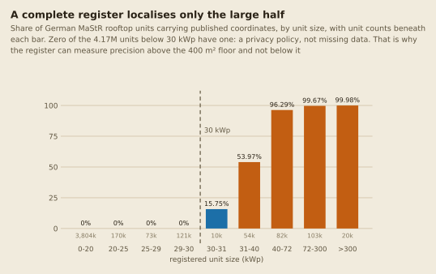
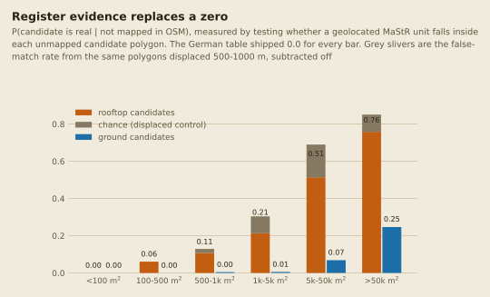

# Validating against a complete register: Germany and MaStR

Every accuracy figure this project quotes for Pakistan is bounded by the same thing: the
calibration quadrats behind it (see [Calibration quadrats](calibration-quadrats.md) for the
current count) were hand-picked rather than randomly sampled, their
completeness is attested by one mapper rather than independently verified, and that
completeness is relative to the date of the background imagery used for mapping rather
than the date of the Sentinel-2 composite the model actually reads. Those are real limits
and no amount of additional modelling removes them.

Germany is the one place where a different standard is available. Registration in the
**Marktstammdatenregister (MaStR)** is legally mandatory for grid-connected PV, so
per-municipality rooftop capacity there is not a sample to be compared against, it is the
answer. `earthpv validate-mastr` uses it to test the parts of the capacity chain that
nothing else in this project can check.

```bash
earthpv mastr                       # once: download the register (multi-GB, hours)
earthpv validate-mastr --aoi germany \
  --solar-path /path/to/rooftopsenti/data/germany_500/osm/solar.parquet
```

Writes `results/germany_mastr_validation.json`. Everything except the last section runs
in the default (no-torch) environment, needs no GPU, and takes under a minute once the
register is downloaded.

## What is below the detection floor, measured rather than proxied

The reason this project has two detectors instead of one is the claim that the &ge; 400 m&sup2;
segmentation model is blind to most rooftop capacity. Until now that claim was supported
by MaStR's "72.6% of rooftop capacity is in units &le; 100 kWp" &mdash; a round-number
proxy, quoted nationally.

The register carries exact per-unit capacity, so the share below the project's *own* floor
can be measured directly. 400 m&sup2; of module area at 0.18 kWp/m&sup2; is **72 kWp**:

| Unit size | Share of rooftop **capacity** | Share of rooftop **installations** |
|---|---|---|
| &le; 10 kWp | 24.0% | 60.0% |
| &le; 30 kWp | 56.8% | 93.9% |
| **&le; 72 kWp (the 400 m&sup2; floor)** | **65.5%** | **97.2%** |
| &le; 100 kWp | 72.6% | 98.5% |
| &le; 300 kWp | 83.2% | 99.6% |
| &le; 1000 kWp | 96.4% | 100.0% |

Measured 2026-08-11 on 4,411,015 rooftop units totalling 74.8 GWp, commissioning cutoff
2025-09-30. The &le; 100 kWp row reproduces the figure this project already quotes, which
is the check that the filters here match `mastr.aggregate_gemeinden`'s.


The vertical gap between the two curves at the floor is the whole caution about quoting
this result: the count share saturates almost immediately because small units dominate
any register by number, while capacity accumulates slowly because one industrial roof
outweighs hundreds of homes.

Two things to take from this table. First, the claim holds and is now measured at the right
threshold: **65.5%** of German rooftop capacity sits below the segmentation floor, so an
instrument that only sees above it is describing roughly a third of the quantity a "rooftop
solar" headline implies. Second, the capacity and installation columns are very far apart
&mdash; 97.2% of installations against 65.5% of capacity &mdash; and quoting the count share
when the reader will hear the capacity share overstates the gap substantially. Both belong
in any statement of this result.

## The same share is not transferable as one number

This project transfers Germany's share to Pakistan as a constant, to sanity-check its own
sub-400 m&sup2; total (`docs/methods/density.md`'s MaStR-shape transfer, which implied
roughly 5.9 GWp). A transfer like that is only as good as the constancy of the thing being
transferred, and measured across 10,675 German municipalities with at least 100 kW of
rooftop capacity, it is not constant:

| | Share below 72 kWp | Share below 100 kWp |
|---|---|---|
| National (capacity-weighted) | 0.655 | 0.726 |
| Unweighted mean over municipalities | 0.724 | 0.785 |
| Median municipality | 0.762 | 0.845 |
| 5th &ndash; 95th percentile | 0.249 &ndash; 1.000 | 0.295 &ndash; 1.000 |
| Standard deviation | 0.235 | 0.228 |
| Spearman vs. municipality capacity | **-0.42** | **-0.47** |

The negative rank correlation is the part that matters, because it is a bias with a known
direction rather than just noise. Rooftop capacity concentrates in municipalities with
large industrial roofs, and those have a *lower* small-PV share than a typical
municipality. So the unweighted average across municipalities (0.724) sits 7 points above
the national capacity-weighted figure (0.655), and any transfer that reasons from "a
typical place" rather than from a capacity-weighted total will overstate the small-PV
share. The 5th-to-95th spread of 0.25 to 1.00 sets the wider caution: this is a quantity
that varies by a factor of about 2.7 between the 10th and 90th percentile municipality
within a single country, so carrying it across a border as a point value is a much weaker
step than the tidy national percentage makes it look.

## OpenStreetMap cannot serve as the complete reference, even in Germany

A natural plan is to skip the register and use German OSM as ground truth, since Germany
is famously well mapped. Measured against MaStR, that plan does not survive.

The measurement has to avoid one specific circularity. `data/calibration/completeness.parquet`
defines completeness as `0.18 x osm_area / kw_rooftop`, which already assumes the very
kWp/m&sup2; constant one might want to test; selecting "well-mapped" municipalities with it
and then measuring `kw_rooftop / osm_area` is selecting on the estimator. So
`osm_completeness_by_count` measures completeness by **unit count** against the register
instead, which involves no area and no conversion constant at all.

National result: of 4,411,015 registered rooftop units, OSM has **3.6%**. The well-mapped
tail is thin, and the implied constant is unstable across it:

| Minimum count completeness | Municipalities | Pooled implied kWp/m&sup2; |
|---|---|---|
| &ge; 30% | 55 | 0.239 |
| &ge; 50% | 18 | 0.083 |
| &ge; 80% | 3 | 0.069 |

Per-municipality implied values span 0.02 to 0.99 against the project's 0.18. A spread
like that is not sampling noise around a true value: nothing in OSM records whether a
`generator:source=solar` polygon outlines the panel array or the whole roof it sits on, so
the ratio is measuring mapper convention. **The module constant therefore stays as
calibrated, and this route is recorded as a measured negative result rather than a
blocked one.**

Two consequences travel beyond Germany. "Germany is well mapped in OSM" is true of
buildings and false of rooftop PV, and the two are easy to conflate. And the same
array-versus-roof ambiguity applies to this project's Pakistani OSM reference, which is
used both as a recall denominator and as the evidence atlas's own hand-mapped population
&mdash; it is not exempt.

## The register as a precision instrument: measuring p_unmapped

The OSM route above fails as a *completeness* reference. The register itself works as
something narrower and more useful: a way to decide whether an individual detection is
real.

`p_real` per size bin is built as `mapped_frac + (1 - mapped_frac) x p_unmapped`, where
`p_unmapped` is P(candidate is real | no OSM match). Germany had no instrument for that
term at all, so its table shipped `p_unmapped: 0.0` &mdash; an honest floor that prices
every unmapped candidate at zero. That single zero is what held `est_mwp_cal` to an OLS
slope of 0.038 in the first complete run below.

MaStR closes it, but only over part of the range, and the reason is worth stating before
the result. Coordinates are published only at or above 30 kWp:



Zero of the 4.17 million units below 30 kWp carry one. That is a privacy policy, not
missing data &mdash; the same field is 80% populated for ground-mount. Above the cliff the
fill rate is 96% by 40 kWp and 99.7% at or above 72 kWp, the 400 m&sup2; segmentation
floor. So the register can measure precision for exactly the population segmentation
targets, and is structurally silent below it. That is the mirror image of where the
project's calibration need is greatest, and it is why MaStR does not replace mapped
quadrats for `roofclf`: the sub-400 m&sup2; half of the atlas is precisely the half a
register cannot localise.

Note the asymmetry against the size table above. 65.5% of German rooftop *capacity* sits
below the 72 kWp segmentation floor, and the register cannot place any of the units holding
the 56.8% below 30 kWp. A complete register therefore improves the instrument that already
worked and does nothing for the one that needed help most.

`scripts/mastr_p_unmapped.py` tests whether a geolocated unit's address point falls
**inside** an unmapped candidate polygon, per placement and size bin:



| Bin | Rooftop: raw | chance | **p_unmapped** | Ground |
|---|---|---|---|---|
| 100-500 m&sup2; | 0.061 | 0.000 | **0.061** (n=379) | 0.000 (n=573) |
| 500-1k | 0.127 | 0.022 | **0.107** (n=371) | 0.004 (n=460) |
| 1k-5k | 0.285 | 0.091 | **0.213** (n=1,914) | 0.005 (n=1,878) |
| 5k-50k | 0.600 | 0.176 | **0.514** (n=4,417) | 0.069 (n=6,303) |
| &gt;50k | 0.781 | 0.093 | **0.759** (n=146) | 0.247 (n=817) |

The term is **attributable to a placement**, which the glint sample never was &mdash; that
was the stated reason `derive_placement_tables` refused to split `p_unmapped` and instead
forced ground to 0.0 and let rooftop inherit the pooled value. The rooftop/ground split here
is a factor of seven in the 5k-50k bin, so pooling them would have been the same error the
placement split exists to prevent.

### The chance term has to be land-use matched

The first version of this measurement got the null wrong, and it is the easiest thing to get
wrong here. It used only a displaced control &mdash; the same polygons moved 500 m and
1,000 m on a random bearing &mdash; which put the false-match rate at 0.3-2.3%. But
displacing a polygon that far can move it off the built-up area entirely, into farmland
where no rooftop unit could be registered, so it measures how empty the countryside is
rather than how often a false positive captures a neighbour's unit.

The right null is the base rate among buildings the model did **not** detect, in the same
imaged cells and the same size bin:

| Bin | Undetected buildings | Contain a registered unit |
|---|---|---|
| 500-1k m&sup2; | 48,841 | 2.2% |
| 1k-5k | 24,967 | 9.1% |
| 5k-50k | 2,119 | 17.6% |

Large German roofs carry registered PV often enough that containment alone is weak evidence.
Candidates still run 2.8-4.8x above that null, so the signal is real, but the naive version
overstated `p_unmapped` by 10-25% (5k-50k: 0.577 against 0.514). With a land-use-matched `f`
the correction is the two-component mixture `(obs - f) / (1 - f)` rather than a subtraction.

`>50k` keeps the displaced control, because VIDA footprints that large barely exist (17 in
the sample) and the matched null cannot be measured there; that bin is flagged in the CSV's
`f_source` column. Ground keeps it throughout, deliberately: "an undetected building of this
size" is not the right null for a ground-mount candidate.

The result remains a **lower bound**, in the direction that matters: a real installation
whose address point is geocoded a few metres off the roof outline counts as a miss, one
below 30 kWp has no coordinate to match at all, and the mixture assumes a real array's point
always lands inside its own polygon when in practice it sometimes does not.

### The sensitivity division that was rejected

The obvious refinement is to divide by a positive control, the way this project inverts the
glint instrument: measure the match rate `S` among OSM-mapped (corroborated-real)
candidates and report `(obs - f) / (S - f)`. That was measured and **rejected**.

For ground it behaves: `S` = 0.589 against `obs` = 0.069 in the 5k-50k bin. For rooftop it
inverts &mdash; `S` = 0.435 on 200 candidates against `obs` = 0.599 on 4,417, and the
&gt;50k "control" is 16 candidates. The cause is structural rather than sample noise. German
OSM rooftop PV is the 3.6%-complete, enthusiast-mapped population measured in the previous
section, which skews to small residential arrays; those are below 30 kWp and so carry no
coordinate by policy. The control is contaminated by precisely the suppression it was meant
to absorb, and dividing by it clips nearly every rooftop bin to 1.0. The raw controls are
written to `results/germany_mastr_p_unmapped_controls.csv` so the claim stays checkable.

## The end-to-end comparison

`validate_density_against_mastr` zonal-joins a `density` run's grid onto German
municipalities and reports, per estimator, the origin-forced OLS slope (multiplicative
bias, 1.0 = right on average), the median per-municipality ratio, Spearman rank
correlation and log-log Pearson. Because MaStR is complete, a slope against it is a real
accuracy statement rather than a comparison of two estimates &mdash; which is exactly what
Pakistan cannot provide.

It reports its own imagery coverage and refuses to describe a partial-coverage result as
national. That guard is not hypothetical: a run covering 4 of Germany's 76 MGRS tiles
would produce a national sum around 5% of the truth, and the resulting slope would read as
a catastrophic model failure rather than as missing imagery.

**It ran nationally on 2026-08-31.** Blockers 1 and 2 above were closed by acquisition on
2026-08-23 (4,656 composited cells; `data/vida/DEU.parquet`, 27.9M rows). Blocker 3 stands:
Germany still has zero calibration quadrats, so this is a segmentation-only comparison with no
`roofclf` half. Coverage is 10,533 of 10,949 municipalities, **96.2% by count and 99.75% by
capacity**, so the guard reports it as national rather than refusing.

Read the **above-floor** block. Truth there is `kw_rooftop - kw_le_72` = 25,723.5 MWp, the
registered capacity a &ge; 400 m&sup2; model can actually see; against all rooftop capacity
every slope falls by roughly the 65.5% sub-floor share, which describes the floor rather than
the model.

| Estimator | Slope | Predicted MWp | Spearman &rho; |
|---|---|---|---|
| `est_mwp_rc_roof` | **0.405** | 12,509.7 | 0.628 |
| `est_mwp_exp` | 0.388 | 13,110.4 | 0.656 |
| `est_mwp_det` | 0.340 | 10,699.6 | 0.661 |
| `est_mwp_cal` | 0.167 | 5,190.2 | 0.651 |

Ranking transfers and level does not: &rho; sits at 0.63-0.66 across estimators whose slopes
span 0.17 to 0.41. The best-calibrated recovers about 40% of the capacity it could see.

### Two errors that were cancelling

Neither correction below would have been visible without a complete reference, and the second
was found only because the first was made.

Fixing `p_unmapped` (previous section) moved `est_mwp_cal` from 0.038 to 0.167 as intended. It
also moved `est_mwp_rc_roof` from 0.262 to **3.11** &mdash; from understating truth to
overstating it threefold. A plausible-looking national total had been the product of two large
errors pointing in opposite directions.

The second error was in the recall denominator, and not where it was first looked for.
`capacity_calibration.derive_placement_tables` restricted **both** sides of the recall
measurement by placement, so a rooftop reference installation counted as found only if the
candidate that found it was also classified `rooftop`:

| Rooftop bin | vs same-placement candidates | vs any candidate | factor |
|---|---|---|---|
| 500-1k m&sup2; | 0.128 | 0.167 | 1.3x |
| 1k-5k | 0.214 | 0.268 | 1.25x |
| 5k-50k | 0.096 | 0.693 | 7.3x |
| &gt;50k | 0.036 | 0.852 | **23.9x** |

Precision and recall are asymmetric. `mapped_frac` asks "is this candidate real", so its
corroboration must come from references of its own placement. Recall asks "was this real
installation detected at all", and how `postprocess` labelled the finding candidate says
nothing about that. The mechanism explains why the error grew with installation size: a large
array overruns its imagery-derived VIDA footprint, `building_overlap_frac` collapses, and a
candidate that correctly found a rooftop installation is classified `ground_adjacent` or
`no_building`. `1/recall` then inflated it by up to the 20x `DEFAULT_RECALL_FLOOR` clamp.

Fixed 2026-09-02. `est_mwp_rc` moved from 114,145 to 24,687 MWp nationally and its slope from
3.11 to 0.405. `est_mwp_det` and `est_mwp_exp` did not move at all, the sanity check that
neither uses recall.

Two hypotheses were written down first and both were measured and refuted: that oversize
`rooftop` reference features deflated the top bin (they recall at 0.841, no different from the
rest), and that count-recall applied to area inflated the estimator (area/count ratio 1.01 to
1.08). The wrong diagnosis was the plausible one, which is why it is recorded.

**Pakistan shares this code and has no register to notice.** Its rooftop recall moves 0.423 to
0.808 in the 5k-50k bin, 0.065 to 0.952 above 50k, and ground 0.107 to 0.417 in 500-1k, so its
`est_mwp_rc` and Best estimate are **overstated**. Pakistan's figures come from the checked-in
calibration table and do not change until it is deliberately re-derived, which needs the glint
sample and the calibration boxes. That has not been run.

### The atlas totals do not survive the same check

Germany's evidence atlas reports Verified 38,508 MWp and Best 49,324 MWp, and both are too
high. Verified is the hand-mapped OSM population converted at the two constants; its ground
component alone is 43,965 MWp against 37,138 MWp of all registered German ground-mount, or
**118%**. That is the OSM-convention problem from the section above turned into a hard
contradiction: area times a constant does not give German capacity when the polygon may
outline the roof or the site rather than the array. The atlas is published for its structure
and per-cell geography; the defensible German figure is `est_mwp_rc_roof`.

The harness is also covered by `tests/test_mastr_validation.py`, which feeds the register back
through it synthetically. That still matters now that it runs on real data, because a
synthetic case is the only way to check the arithmetic against a known answer:
a grid carrying exactly MaStR's own capacity must return slope 1.0, one carrying half of it
must return 0.5, and a 200-municipality grid must be refused as non-national. That pins the
arithmetic &mdash; units, the origin-forced fit, the kW-to-MWp conversion, the coverage
guard &mdash; rather than merely running the code.
